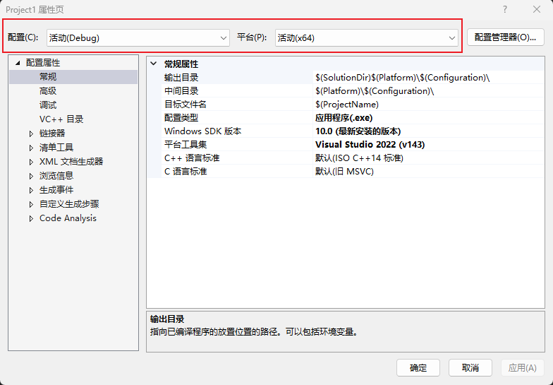

# c++是如何工作的

## 从Hello World开始

``` cpp
// main.cpp
#include <iostream>

int main()
{
    std::cout << "Hello World!" << std::endl;
    std::cin.get();
}
```
在main.cpp文件中，`#include <iostream>`是预处理，通常在符号`#`之后的的语句都是预处理语句，编译器在收到源文件后，会先处理预处理语句，即：***它们在实际编译发生之前就被处理了***。

main函数：***程序入口***，main函数不一定需要返回值，没有返回值默认返回1。

std::cout << "Hello World!" << std::endl: `<<`实际上是运算符，而运算符实际上可以看作是函数，所以这句话可以等价于：`std::cout.print("Hello World!").print(std::endl)`

## 如何将源文件转成可运行的二进制文件

1. step1:处理预编译语句
   
   在这个代码中，编译器会将`iostream`这个文件完成的拷贝粘贴到代码文件中
2. step2:编译
   
   c++代码 --> 实际机器代码

   编译过程仅编译cpp文件，这是因为头文件的内容在预处理是被包含进来了，随着cpp文件编译被编译

   编译后每个cpp文件都会生成一个.obj文件

   > **解决方案配置设置目标平台规则**：

   1. 设置release模式时，对正在使用的debug模式没有任何影响

     

   2. SDK版本、输出目录、中间目录
   3. 配置类型：生成的文件类型
   4. debug模式下优化不可用，所以debug编译比release模式慢很多

3. step:链接

   **将所有的obj文件粘合到一起**

   > 申明：对象存在
   
   > 定义：这个对象到底是什么

# c++编译器是如何工作的

**将文本文件装换成obj文件**

抽象语法树

1. 预处理：遍历所有的预处理语句进行预处理
   > #include：复制头文件中的所有内容到当前文件  
   > #define：替换  
   > #if：判定
2. 记号化和解析 c++格式==>编译器能够真正理解和推理的格式，创建抽象语法树
3. 生成CPU执行的代码

# c++链接器是如何工作的

**链接所有obj文件**

# c++变量

> char:      1  
> short:     2  
> int:       4(取决于编译器)  
> long:      4(取决于编译器)  
> long long: 8  
> float:     4(flort var = 5.5f)
> double:    8  
> bool:      1

# 函数

*被设计用来执行特定任务的代码块*