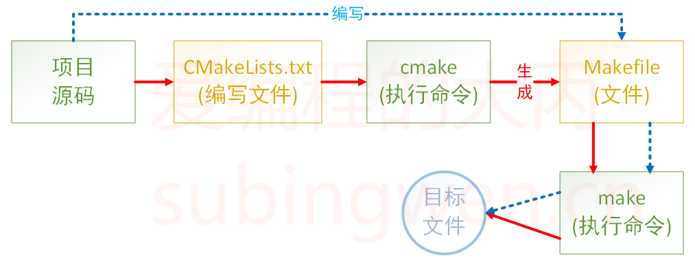

# 1. CMake概述

CMake 是一个项目构建工具，并且是跨平台的。关于项目构建我们所熟知的还有Makefile（通过 make 命令进行项目的构建），大多是IDE软件都集成了make，比如：VS 的 nmake、linux 下的 GNU make、Qt 的 qmake等，如果自己动手写 makefile，会发现，makefile 通常依赖于当前的编译平台，而且编写 makefile 的工作量比较大，解决依赖关系时也容易出错。

而 CMake 恰好能解决上述问题， 其允许开发者指定整个工程的编译流程，在根据编译平台，**自动生成本地化的Makefile和工程文件**，最后用户只需`make`编译即可，所以可以把CMake看成一款自动生成 Makefile的工具，其编译流程如下图：



* 蓝色虚线表示使用`makefile`构建项目的过程
* 红色实线表示使用`cmake`构建项目的过程

> [!TIP]
> **优点**
> 1. 跨平台
> 2. 能够管理大型项目
> 3. 简化编译构建过程和编译过程
> 4. 可扩展：可以为 cmake 编写特定功能的模块，扩充 cmake 功能

# 2. CMake使用

`CMake`支持大写、小写、混合大小写的命令。如果在编写CMakeLists.txt文件时使用的工具有对应的命令提示，那么大小写随缘即可，不要太过在意。

## 2.1 注释

### 2.1.1 注释行

`CMake`使用`#`进行行注释，可以放在任何位置。

```cmake
# 这是一个 CMakeLists.txt 文件
cmake_minimum_required(VERSION 3.0.0)
```

### 2.1.2 块注释

`CMake`使用`#[[ ]]`形式进行块注释。

```cmake
#[[ 这是一个 CMakeLists.txt 文件。
这是一个 CMakeLists.txt 文件
这是一个 CMakeLists.txt 文件]]
cmake_minimum_required(VERSION 3.0.0)
```

## 2.2 只有源文件

### 2.2.1 共处一室

1. 准备一下几个文件
 
* add.cpp

```cpp
#include <stdio.h>
#include "head.h"

int add(int a, int b)
{
    return a+b;
}
```

* sub.cpp

```cpp
#include <stdio.h>
#include "head.h"

int sub(int a, int b)
{
    return a - b;
}
```

* mult.cpp

```cpp
#include <stdio.h>
#include "head.h"

int mult(int a, int b)
{
    return a * b;
}
```

* div.cpp

```cpp
#include <stdio.h>
#include "head.h"

double div(int a, int b)
{
    return (double)a / b;
}
```

* head.h

```cpp
#ifndef _HEAD_H_
#define _HEAD_H_

int add(int a, int b);
int sub(int a, int b);
int mult(int a, int b);
float div(int a, int b);

#endif
```

* main.cpp

```cpp
#include <stdio.h>
#include "head.h"

int main()
{
    int a = 20;
    int b = 12;

    printf("a = %d, b = %d\n", a, b);
    printf("a + b = %d\n", add(a, b));
    printf("a - b = %d\n", sub(a, b));
    printf("a * b = %d\n", mult(a, b));
    printf("a / b = %f\n", div(a, b));

    return 0;
}
```

2. 上述文件的目录结构如下：
   
```term
zhaohaifei@XTZJ-20221120IX:/mnt/d/MyGithubNote/MyNote/code/CMake-demo/V1$ tree
.
├── add.cpp
├── div.cpp
├── head.h
├── main.cpp
├── mult.cpp
└── sub.cpp
```

3. 生成`CMakeLists.txt`文件

在上述源文件所在目录下添加一个新文件`CMakeLists.txt`，文件内容如下：

```cmake
cmake_minimum_required(VERSION 3.15)
project(CALC)
add_executable(app add.cpp div.cpp main.cpp mult.cpp sub.cpp)
```
* `cmake_minimum_required`：指定使用的cmake的最低版本
  * 可选，非必须，如果不加可能会有警告

* `project`：定义工程名称，并可指定工程的版本、工程描述、web主页地址、支持的语言（默认情况支持所有语言），如果不需要这些都是可以忽略的，只需要指定出工程名字即可。

    ```cmake
    # PROJECT 指令的语法是：
    project(<PROJECT-NAME> [<language-name>...])
    project(<PROJECT-NAME>
        [VERSION <major>[.<minor>[.<patch>[.<tweak>]]]]
        [DESCRIPTION <project-description-string>]
        [HOMEPAGE_URL <url-string>]
        [LANGUAGES <language-name>...])
    ```

* `add_executable`：定义工程会生成一个可执行程序

    ```cmake
    add_executable(可执行程序名 源文件名称)
    ```

  * 这里的可执行程序名和project中的项目名没有任何关系

  * 源文件名可以是一个也可以是多个，如有多个可用空格或;间隔
        ```cmake
        # 样式1
        add_executable(app add.cpp div.cpp main.cpp mult.cpp sub.cpp)
        # 样式2
        add_executable(app add.cpp;div.cpp;main.cpp;mult.cpp;sub.cpp)
        ```
4. 执行`cmake`命令

```term
zhaohaifei@XTZJ-20221120IX:/mnt/d/MyGithubNote/MyNote/code/CMake-demo/V1$ tree
.
├── CMakeLists.txt
├── add.cpp
├── div.cpp
├── head.h
├── main.cpp
├── mult.cpp
└── sub.cpp

0 directories, 7 files
zhaohaifei@XTZJ-20221120IX:/mnt/d/MyGithubNote/MyNote/code/CMake-demo/V1$ cmake .
-- The C compiler identification is GNU 11.4.0
-- The CXX compiler identification is GNU 11.4.0
-- Detecting C compiler ABI info
-- Detecting C compiler ABI info - done
-- Check for working C compiler: /usr/bin/cc - skipped
-- Detecting C compile features
-- Detecting C compile features - done
-- Detecting CXX compiler ABI info
-- Detecting CXX compiler ABI info - done
-- Check for working CXX compiler: /usr/bin/c++ - skipped
-- Detecting CXX compile features
-- Detecting CXX compile features - done
-- Configuring done (1.9s)
-- Generating done (0.1s)
-- Build files have been written to: /mnt/d/MyGithubNote/MyNote/code/CMake-demo/V1
```

当执行`cmake`命令之后，`CMakeLists.txt`中的命令就会被执行，所以一定要注意给`cmake`命令指定路径的时候一定不能出错。

执行命令之后，看一下源文件所在目录中是否多了一些文件：

```term
zhaohaifei@XTZJ-20221120IX:/mnt/d/MyGithubNote/MyNote/code/CMake-demo/V1$ tree -L 1
.
├── CMakeCache.txt
├── CMakeFiles
├── CMakeLists.txt
├── Makefile
├── add.cpp
├── cmake_install.cmake
├── div.cpp
├── head.h
├── main.cpp
├── mult.cpp
└── sub.cpp
```

我们可以看到在对应的目录下生成了一个`makefile`文件，此时再执行`make`命令，就可以对项目进行构建得到所需的可执行程序了。

```term
zhaohaifei@XTZJ-20221120IX:/mnt/d/MyGithubNote/MyNote/code/CMake-demo/V1$ tree -L 1
.
├── CMakeCache.txt
├── CMakeFiles
├── CMakeLists.txt
├── Makefile
├── add.cpp
├── app
├── cmake_install.cmake
├── div.cpp
├── head.h
├── main.cpp
├── mult.cpp
└── sub.cpp
```

最终可执行程序**app**就被编译出来了（这个名字是在**CMakeLists.txt**中指定的）。

```term
zhaohaifei@XTZJ-20221120IX:/mnt/d/MyGithubNote/MyNote/code/CMake-demo/V1$ ./app
a = 20, b = 12
a + b = 32
a - b = 8
a * b = 240
a / b = 1.666667
```

### 2.2.2 VIP包房

通过上面的例子可以看出，如果在CMakeLists.txt文件所在目录执行了cmake命令之后就会生成一些目录和文件（包括 makefile 文件），如果再基于makefile文件执行make命令，程序在编译过程中还会生成一些中间文件和一个可执行文件，这样会导致整个项目目录看起来很混乱，不太容易管理和维护，此时我们就可以把生成的这些与项目源码无关的文件统一放到一个对应的目录里边，比如将这个目录命名为build:

```cmake
zhaohaifei@XTZJ-20221120IX:/mnt/d/MyGithubNote/MyNote/code/CMake-demo/V1$ mkdir build
zhaohaifei@XTZJ-20221120IX:/mnt/d/MyGithubNote/MyNote/code/CMake-demo/V1$ cd build/
zhaohaifei@XTZJ-20221120IX:/mnt/d/MyGithubNote/MyNote/code/CMake-demo/V1/build$ cmake ..
-- The C compiler identification is GNU 11.4.0
-- The CXX compiler identification is GNU 11.4.0
-- Detecting C compiler ABI info
-- Detecting C compiler ABI info - done
-- Check for working C compiler: /usr/bin/cc - skipped
-- Detecting C compile features
-- Detecting C compile features - done
-- Detecting CXX compiler ABI info
-- Detecting CXX compiler ABI info - done
-- Check for working CXX compiler: /usr/bin/c++ - skipped
-- Detecting CXX compile features
-- Detecting CXX compile features - done
-- Configuring done (1.8s)
-- Generating done (0.1s)
-- Build files have been written to: /mnt/d/MyGithubNote/MyNote/code/CMake-demo/V1/build
zhaohaifei@XTZJ-20221120IX:/mnt/d/MyGithubNote/MyNote/code/CMake-demo/V1/build$ make
[ 16%] Building CXX object CMakeFiles/app.dir/add.cpp.o
[ 33%] Building CXX object CMakeFiles/app.dir/div.cpp.o
[ 50%] Building CXX object CMakeFiles/app.dir/main.cpp.o
[ 66%] Building CXX object CMakeFiles/app.dir/mult.cpp.o
[ 83%] Building CXX object CMakeFiles/app.dir/sub.cpp.o
[100%] Linking CXX executable app
[100%] Built target app
zhaohaifei@XTZJ-20221120IX:/mnt/d/MyGithubNote/MyNote/code/CMake-demo/V1/build$ tree -L 1
.
├── CMakeCache.txt
├── CMakeFiles
├── Makefile
├── app
└── cmake_install.cmake

1 directory, 4 files
zhaohaifei@XTZJ-20221120IX:/mnt/d/MyGithubNote/MyNote/code/CMake-demo/V1/build$ ./app 
a = 20, b = 12
a + b = 32
a - b = 8
a * b = 240
a / b = 1.666667
```

## 2.3 私人定制

### 2.3.1 定义变量

在上面的例子中一共提供了5个源文件，假设这五个源文件需要反复被使用，每次都直接将它们的名字写出来确实是很麻烦，此时我们就需要定义一个变量，将文件名对应的字符串存储起来，在cmake里定义变量需要使用`set`。

```cmake
# SET 指令的语法是：
# [] 中的参数为可选项, 如不需要可以不写
SET(VAR [VALUE] [CACHE TYPE DOCSTRING [FORCE]])
```

* `VAR`: 变量名
* 
* `VALUE`: 变量值

```cmake
# 方式1: 各个源文件之间使用空格间隔
# set(SRC_LIST add.c  div.c   main.c  mult.c  sub.c)

# 方式2: 各个源文件之间使用分号 ; 间隔
set(SRC_LIST add.c;div.c;main.c;mult.c;sub.c)
add_executable(app  ${SRC_LIST})
```

### 2.3.2 指定使用C++标准

``` term
zhaohaifei@XTZJ-20221120IX:/mnt/d/MyGithubNote/MyNote/code/CMake-demo/V1$ g++ *.cpp -std=c++11 -o app
```

上面的例子中通过参数`-std=c++11`指定出要使用c++11标准编译程序，C++标准对应有一宏叫做`DCMAKE_CXX_STANDARD`。在CMake中想要指定C++标准有两种方式：

1. 在CMakeLists.txt中通过`set`命令指定

```cmake
#增加-std=c++11
set(CMAKE_CXX_STANDARD 11)
#增加-std=c++14
set(CMAKE_CXX_STANDARD 14)
#增加-std=c++17
set(CMAKE_CXX_STANDARD 17)
```

2. 在执行cmake命令的时候指定出这个宏的值

```term
#增加-std=c++11
zhaohaifei@XTZJ-20221120IX:/mnt/d/MyGithubNote/MyNote/code/CMake-demo/V1/build$ cmake .. -DCMAKE_CXX_STANDARD=11
#增加-std=c++14
zhaohaifei@XTZJ-20221120IX:/mnt/d/MyGithubNote/MyNote/code/CMake-demo/V1/build$ cmake .. -DCMAKE_CXX_STANDARD=14
#增加-std=c++17
zhaohaifei@XTZJ-20221120IX:/mnt/d/MyGithubNote/MyNote/code/CMake-demo/V1/build$ cmake .. -DCMAKE_CXX_STANDARD=17
```

### 2.3.3 指定输出的路径

在CMake中指定可执行程序输出的路径，也对应一个宏，叫做`EXECUTABLE_OUTPUT_PATH`，它的值还是通过set命令进行设置:

```cpp
set(HOME /home/robin/Linux/Sort)
set(EXECUTABLE_OUTPUT_PATH ${HOME}/bin)
```

* 第一行：定义一个变量用于存储一个绝对路径
* 第二行：将拼接好的路径值设置给EXECUTABLE_OUTPUT_PATH宏
  * 如果这个路径中的子目录不存在，会自动生成，无需自己手动创建

> [!NOTE]
> 由于可执行程序是基于 cmake 命令生成的 makefile 文件然后再执行 make 命令得到的，所以如果此处指定可执行程序生成路径的时候使用的是相对路径 ./xxx/xxx，那么这个路径中的 ./ 对应的就是 makefile 文件所在的那个目录。

## 2.4 搜索文件

`aux_source_directory`命令或者`file`命令

### 2.4.1 方式1

在CMake中使用`aux_source_directory`命令可以查找某个路径下的所有源文件，命令格式为

```cmake
aux_source_directory(< dir > < variable >)
```

* `dir`：要搜索的目录
* `variable`：将从dir目录下搜索到的源文件列表存储到该变量中

```cmake
cmake_minimum_required(VERSION 3.15)

project(CALC)

# set(SRC_LIST add.cpp div.cpp main.cpp mult.cpp sub.cpp)
aux_source_directory(${PROJECT_SOURCE_DIR} SRC_LIST)

set(EXECUTABLE_OUTPUT_PATH ../bin)

set(CMAKE_CXX_STANDARD 11)

add_executable(app ${SRC_LIST})
```

* `PROJECT_SOURCE_DIR`: 执行`cmake`命令时，`cmake`后面跟随的路径

### 2.4.2 方式2

如果一个项目里边的源文件很多，在编写CMakeLists.txt文件的时候不可能将项目目录的各个文件一一罗列出来，这样太麻烦了。所以，在CMake中为我们提供了搜索文件的命令，他就是`file`（当然，除了搜索以外通过`file`还可以做其他事情）。

```cmake
file(GLOB/GLOB_RECURSE 变量名 要搜索的文件路径和文件类型)
```

* `GLOB`: 将指定目录下搜索到的满足条件的所有文件名生成一个列表，并将其存储到变量中。
* `GLOB_RECURSE`：递归搜索指定目录，将搜索到的满足条件的文件名生成一个列表，并将其存储到变量中。

搜索当前目录的src目录下所有的源文件，并存储到变量中

```cmake
cmake_minimum_required(VERSION 3.15)

project(CALC)

# set(SRC_LIST add.cpp div.cpp main.cpp mult.cpp sub.cpp)
# aux_source_directory(${PROJECT_SOURCE_DIR} SRC_LIST)
file(GLOB SRC_LIST ${CMAKE_CURRENT_SOURCE_DIR}/*.cpp)

set(EXECUTABLE_OUTPUT_PATH ../bin)

set(CMAKE_CXX_STANDARD 11)

add_executable(app ${SRC_LIST})
```

* `CMAKE_CURRENT_SOURCE_DIR`宏表示当前访问的CMakeLists.txt文件所在的路径。
* 关于要搜索的文件路径和类型可加双引号，也可不加:
```cmake
file(GLOB MAIN_HEAD "${CMAKE_CURRENT_SOURCE_DIR}/src/*.h")
```

## 2.5 包含头文件

`include_directories`命令：

```cmake
include_directories(headpath)
```

当前目录结构如下：

```term
zhaohaifei@XTZJ-20221120IX:/mnt/d/MyGithubNote/MyNote/code/CMake-demo/V2$ tree
.
├── CMakeLists.txt
├── bin
│   └── app
├── build
├── include
│   └── head.h
└── src
    ├── div.cpp
    ├── main.cpp
    ├── mult.cpp
    ├── sub.cpp
    └── add.cpp
```

`CMakeLists.txt`内容如下：
```cmake
cmake_minimum_required(VERSION 3.15)

project(CALC)

# set(SRC_LIST add.cpp div.cpp main.cpp mult.cpp sub.cpp)
# aux_source_directory(${PROJECT_SOURCE_DIR} SRC_LIST)
file(GLOB SRC_LIST ${CMAKE_CURRENT_SOURCE_DIR}/src/*.cpp)
include_directories(${CMAKE_CURRENT_SOURCE_DIR}/include/)

set(EXECUTABLE_OUTPUT_PATH ../bin)

set(CMAKE_CXX_STANDARD 11)

add_executable(app ${SRC_LIST})
```

## 2.6 制作动态库或静态库

### 2.6.1 制作静态库

### 2.6.2 制作动态库

## 2.7 日志

## 2.8 变量操作 

# 3. 预宏定义

# 4. 嵌套的CMake

# 5. 流程控制