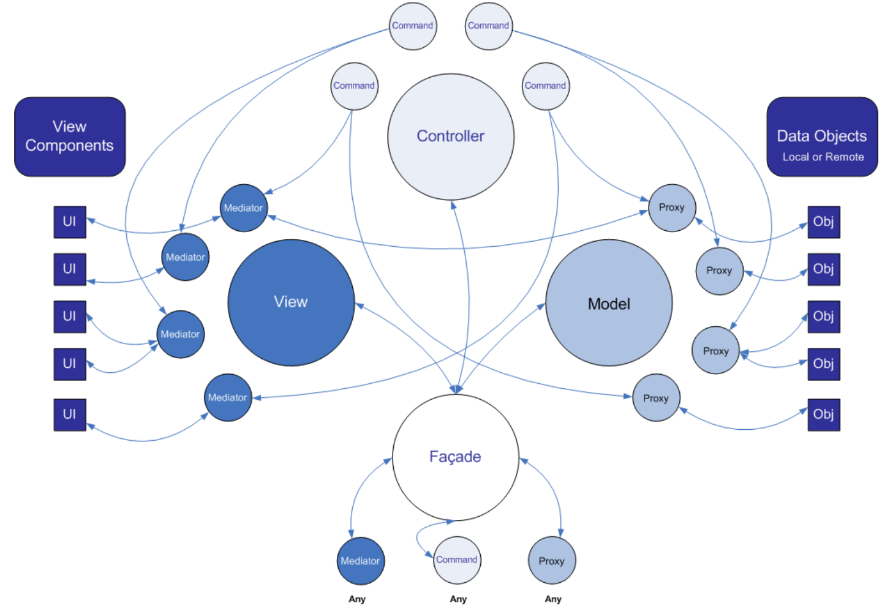
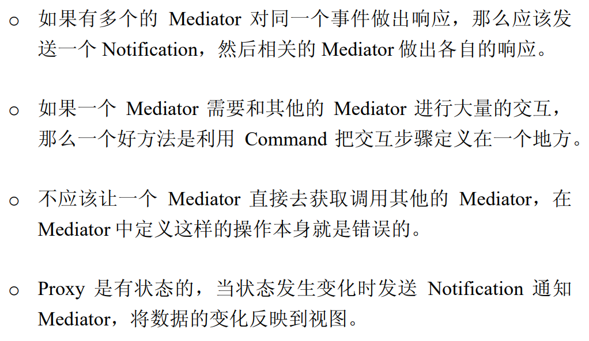

# pureMVC



* `Model`: 保存对`Proxy`对象的引用   
* `Proxy`: 负责操作数据模型，与远程服务通信存取数据。
* `View`: 保存对`Mediator`对象的引用
* `Mediator`: 操作具体的视图组件, 包括：添加事件监听器 ，发送或接收`Notification`，直接改变视图组件的状态。
* `Controller`: 保存所有`Command`的映射
* `Command`: 是无状态的，只在需要时才被创建。`Command`可以获取`Proxy`对象并与之交互，发送`Notification`，执行其他的`Command`
* `Façade`: 应用单例模式，它负责初始化核心层（`Model`，`View`和`Controller`），并能访问它们的`Public`方法。 `Model`，`View`和`Controller`可以通过创建的`Façade`类来相互访问通信。
* `Notification`: `Facade`保存了`Command`与`Notification`之间的映射。当`Notification`发出时，对应的 `Command`就会自动地由`Controller`执行。`Command`实现复杂的交互，降低`View`和`Model`之间的耦合性。

## `Façade`

> 单例

1. ```cpp
   explicit Facade(std::string const& key = Facade::DEFAULT_KEY);
   ```
2. ```cpp
   static IFacade& getInstance(std::string const& key = Facade::DEFAULT_KEY);
   ```

> 初始化

1. ```cpp 
   virtual void initializeFacade(void);
   ```
2. ```cpp 
   virtual void initializeController(void);
   ```

3. ```cpp 
   virtual void initializeModel(void);
   ```
4. ```cpp 
   virtual void initializeView(void);
   ```
5. ```cpp 
   virtual void registerCommand(std::string const& notification_name, ICommand* command);
   ```
6. ```cpp 
   virtual ICommand* removeCommand(std::string const& notification_name);
   ```
7. ```cpp 
   virtual ICommand const& retrieveCommand(std::string const& notification_name) const;
   ```
8. ```cpp 
   virtual ICommand& retrieveCommand(std::string const& notification_name);
   ```
9. ```cpp 
   virtual bool hasCommand(std::string const& notification_name) const;
   ```
10. ```cpp
   virtual void registerProxy (IProxy* proxy);
   ```
11. ```cpp
   virtual IProxy const& retrieveProxy (std::string const& proxy_name) const;
   ```
12. ```cpp
   virtual IProxy& retrieveProxy (std::string const& proxy_name);
   ```
13. ```cpp
   virtual IProxy* removeProxy (std::string const& proxy_name);
   ```
14. ```cpp
   virtual bool hasProxy(std::string const& proxy_name) const;
   ```
15. ```cpp
   virtual void registerMediator(IMediator* mediator);
   ```
16. ```cpp
   virtual IMediator const& retrieveMediator(std::string const& mediator_name) const;
   ```
17. ```cpp
   virtual IMediator& retrieveMediator(std::string const& mediator_name);
   ```
18. ```cpp
   virtual IMediator* removeMediator(std::string const& mediator_name);
   ```
19. ```cpp
   virtual bool hasMediator(std::string const& mediator_name) const;
   ```
20. ```cpp
    virtual void sendNotification(std::string const& notification_name, void const* body = NULL, std::string const& type = "");
    ```
21. ```cpp 
    virtual void notifyObservers(INotification const& notification);
    ```

## `Command`: 处理业务逻辑

`Controller`会注册侦听每一个`Notification`，当被通知到时，`Controller`会实例化一个该`Notification`对应的`Command`类的对象。最后，将`Notification`作为参数传递给该`Command`对象的`execute`方法。

### `SimpleCommand`和`MacroCommand`的使用

* `SimpleCommand`只有一个`execute`方法，`execute`方法接受一个`Inotification`实例做为参数。
* `MacroCommand`可以顺序执行多个`Command`。每个执行都会创建一个`Command`对象并传参一个对源`Notification`的引用。
* `MacroCommand`在构造方法调用自身的`initializeMacroCommand`函数，在该函数中调用`addSubCommand`添加子`Command`

### 降低`Command`与`Mediator`, `Proxy`的耦合度

发送`Notification`通知`Controller`来执行`Command`，而且只能由`Controller`实例化并执行`Command`。

* 注册、删除`Mediator`、`Proxy`和`Command`，或者检查它们是否已经注册。
* 发送`Notification`通知`Command`或`Mediator`做出响应。
* 获取`Proxy`和`Mediator`对象并直接操作它们。

## `Mediator`: 视图组件与系统其他部分交互的中介器

Qt开发时，重写UI交互组件继承ViewComponent并注册到mediator中使用

### 接口

1. `Mediator(std::string const& mediator_name = Mediator::NAME, void const* view_component = NULL);`
2. `virtual void setViewComponent(void const* view_component);`
3. `virtual Mediator::NotificationNames listNotificationInterests(void) const;`
4. ⭐`virtual void handleNotification(INotification const& notification);`

### 监听并响应`View Component`

1. 检查事件类型或事件的自定义内容。
2. 检查或修改`View Component`的属性（或调用提供的方法）。
3. 检查或修改`Proxy`对象公布的属性（或调用提供的方法）。
4. 发送一个或多个`Notification`，通知别的`Mediatora`或`Command`作出响应。


## `Proxy `

`Proxy`类被设计用来管理程序数据模型。

### `Proxy`的几种类型

* `Remote Proxy`, 当`Proxy`管理的数据存放在远程终端，通过某种服务访问。
* `Proxy and Delegate`, 多个`Proxy`共享对一个服务的访问，`Delegate`封装对服务的控制访问，确保响应正确的返回给相应的请求者。
* `Protection Proxy`, 用于数据对象的访问有不同的权限时。
* `Virtual Proxy`, 对创建开销很大的数据对象进行管理。
* `Smart Proxy`, 首次访问时载入数据对象到内存，并计算它被引用的次数，允许锁定确保其他对象不能修改。

