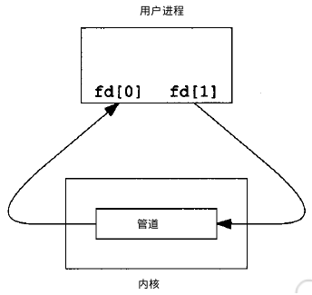
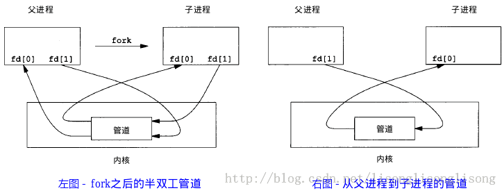
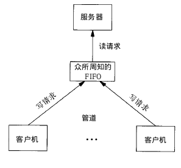

# IPC通信

进程间通信（IPC，InterProcess Communication）是指在不同进程之间传播或交换信息。

IPC的方式通常有管道（包括无名管道和命名管道）、消息队列、信号量、共享存储、Socket、Streams等。其中 Socket和Streams支持不同主机上的两个进程IPC。

## 管道

管道，通常指无名管道，是 UNIX 系统IPC最古老的形式。

### 1. 特点

1. 它是半双工的（即数据只能在一个方向上流动），具有固定的读端和写端。

2. 它只能用于具有亲缘关系的进程之间的通信（也是父子进程或者兄弟进程之间）。

3. 它可以看成是一种特殊的文件，对于它的读写也可以使用普通的read、write 等函数。但是它不是普通的文件，并不属于其他任何文件系统，并且只存在于内存中。

### 2. 原型

```cpp
1 #include <unistd.h>
2 int pipe(int fd[2]);    // 返回值：若成功返回0，失败返回-1
```

当一个管道建立时，它会创建两个文件描述符：`fd[0]`为读而打开，`fd[1]`为写而打开。如下图：



要关闭管道只需将这两个文件描述符关闭即可。

### 3. 例子

单个进程中的管道几乎没有任何用处。所以，通常调用`pipe`的进程接着调用`fork`，这样就创建了父进程与子进程之间的`IPC`通道。如下图所示：



若要数据流从父进程流向子进程，则关闭父进程的读端（fd[0]）与子进程的写端（fd[1]）；反之，则可以使数据流从子进程流向父进程。

```cpp
#include<stdio.h>
#include<unistd.h>

int main()
{
    int fd[2];  // 两个文件描述符
    pid_t pid;
    char buff[20];

    if(pipe(fd) < 0)  // 创建管道
        printf("Create Pipe Error!\n");

    if((pid = fork()) < 0)  // 创建子进程
        printf("Fork Error!\n");
    else if(pid > 0)  // 父进程
    {
        close(fd[0]); // 关闭读端
        write(fd[1], "hello world\n", 12);
    }
    else
    {
        close(fd[1]); // 关闭写端
        read(fd[0], buff, 20);
        printf("%s", buff);
    }

    return 0;
}
```

## FIFO

**FIFO**，也称为命名管道，它是一种文件类型。

### 1. 特点

1. FIFO可以在无关的进程之间交换数据，与无名管道不同。

2. FIFO有路径名与之相关联，它以一种特殊设备文件形式存在于文件系统中。

### 2. 原型

```cpp
#include <sys/stat.h>
// 返回值：成功返回0，出错返回-1
int mkfifo(const char *pathname, mode_t mode);
```

其中的`mode`参数与`open`函数中的`mode`相同。一旦创建了一个`FIFO`，就可以用一般的文件I/O函数操作它。

当`open`一个FIFO时，是否设置非阻塞标志（`O_NONBLOCK`）的区别：

* 若没有指定`O_NONBLOCK`（默认），只读 open 要阻塞到某个其他进程为写而打开此 FIFO。类似的，只写 open 要阻塞到某个其他进程为读而打开它。

* 若指定了`O_NONBLOCK`，则只读 open 立即返回。而只写 open 将出错返回 -1 如果没有进程已经为读而打开该 FIFO，其errno置ENXIO。

### 3. 例子

> FIFO的通信方式类似于在进程中使用文件来传输数据，只不过FIFO类型文件同时具有管道的特性。在数据读出时，FIFO管道中同时清除数据，并且“先进先出”。下面的例子演示了使用 FIFO 进行 IPC 的过程：

```cpp
// write_fifo.c

#include<stdio.h>
#include<stdlib.h>   // exit
#include<fcntl.h>    // O_WRONLY
#include<sys/stat.h>
#include<time.h>     // time

int main()
{
    int fd;
    int n, i;
    char buf[1024];
    time_t tp;

    printf("I am %d process.\n", getpid()); // 说明进程ID

    if((fd = open("fifo1", O_WRONLY)) < 0) // 以写打开一个FIFO
    {
        perror("Open FIFO Failed");
        exit(1);
    }

    for(i=0; i<10; ++i)
    {
        time(&tp);  // 取系统当前时间
        n=sprintf(buf,"Process %d's time is %s",getpid(),ctime(&tp));
        printf("Send message: %s", buf); // 打印
        if(write(fd, buf, n+1) < 0)  // 写入到FIFO中
        {
            perror("Write FIFO Failed");
            close(fd);
            exit(1);
        }
        sleep(1);  // 休眠1秒
    }

    close(fd);  // 关闭FIFO文件
    return 0;
}
```

```cpp
// read_fifo.c

#include<stdio.h>
#include<stdlib.h>
#include<errno.h>
#include<fcntl.h>
#include<sys/stat.h>

int main()
{
    int fd;
    int len;
    char buf[1024];

    if(mkfifo("fifo1", 0666) < 0 && errno!=EEXIST) // 创建FIFO管道
        perror("Create FIFO Failed");

    if((fd = open("fifo1", O_RDONLY)) < 0)  // 以读打开FIFO
    {
        perror("Open FIFO Failed");
        exit(1);
    }

    while((len = read(fd, buf, 1024)) > 0) // 读取FIFO管道
        printf("Read message: %s", buf);

    close(fd);  // 关闭FIFO文件
    return 0;
}
```

在两个终端里分别编译运行上面两个文件，可以看到输出结果如下：

```term
zhaohaifei@asdfasdfsa:/mnt/d/WSL/CMakeLearn/build$ cmake ..
I am 5954 process.
Send message: Process 5954's time is Mon Apr 20 12:37:28 2015
Send message: Process 5954's time is Mon Apr 20 12:37:29 2015
Send message: Process 5954's time is Mon Apr 20 12:37:30 2015
Send message: Process 5954's time is Mon Apr 20 12:37:31 2015
Send message: Process 5954's time is Mon Apr 20 12:37:32 2015
Send message: Process 5954's time is Mon Apr 20 12:37:33 2015
Send message: Process 5954's time is Mon Apr 20 12:37:34 2015
Send message: Process 5954's time is Mon Apr 20 12:37:35 2015
Send message: Process 5954's time is Mon Apr 20 12:37:36 2015
Send message: Process 5954's time is Mon Apr 20 12:37:37 2015
```

```term
zhaohaifei@asdfasdfsa:/mnt/d/WSL/CMakeLearn/build$ ./read_fifo
Read message: Process 5954's time is Mon Apr 20 12:37:28 2015
Read message: Process 5954's time is Mon Apr 20 12:37:29 2015
Read message: Process 5954's time is Mon Apr 20 12:37:30 2015
Read message: Process 5954's time is Mon Apr 20 12:37:31 2015
Read message: Process 5954's time is Mon Apr 20 12:37:32 2015
Read message: Process 5954's time is Mon Apr 20 12:37:33 2015
Read message: Process 5954's time is Mon Apr 20 12:37:34 2015
Read message: Process 5954's time is Mon Apr 20 12:37:35 2015
Read message: Process 5954's time is Mon Apr 20 12:37:36 2015
Read message: Process 5954's time is Mon Apr 20 12:37:37 2015
```

上述例子可以扩展成 客户进程—服务器进程 通信的实例，`write_fifo`的作用类似于客户端，可以打开多个客户端向一个服务器发送请求信息，`read_fifo`类似于服务器，它适时监控着FIFO的读端，当有数据时，读出并进行处理，但是有一个关键的问题是，每一个客户端必须预先知道服务器提供的FIFO接口，下图显示了这种安排：



## 消息队列

**消息队列**，是消息的链接表，*存放在内核中*。一个消息队列由一个标识符（即队列ID）来标识。

### 1. 特点

1. 消息队列是面向记录的，其中的消息具有特定的*格式*以及特定的*优先级*。

2. 消息队列*独立*于发送与接收进程。进程终止时，消息队列及其内容并不会被删除。

3. 消息队列可以实现消息的*随机查询*,消息不一定要以先进先出的次序读取,也可以按消息的类型读取。

### 2. 原型

```cpp
#include <sys/msg.h>
// 创建或打开消息队列：成功返回队列ID，失败返回-1
int msgget(key_t key, int flag);
// 添加消息：成功返回0，失败返回-1
int msgsnd(int msqid, const void *ptr, size_t size, int flag);
// 读取消息：成功返回消息数据的长度，失败返回-1
int msgrcv(int msqid, void *ptr, size_t size, long type,int flag);
// 控制消息队列：成功返回0，失败返回-1
int msgctl(int msqid, int cmd, struct msqid_ds *buf);
```

* 在以下两种情况下，`msgget`将创建一个新的消息队列：

> 1. 如果没有与键值key相对应的消息队列，并且flag中包含了`IPC_CREAT`标志位。
> 2. key参数为`IPC_PRIVATE`。

* 函数msgrcv在读取消息队列时，type参数有下面几种情况：

> 1. `type == 0`，返回队列中的第一个消息；
> 2. `type > 0`，返回队列中消息类型为 type 的第一个消息；
> 3. `type < 0`，返回队列中消息类型值小于或等于 type 绝对值的消息，如果有多个，则取类型值最小的消息。

### 3. 例子

## 信号量

## 共享内存

## socket
