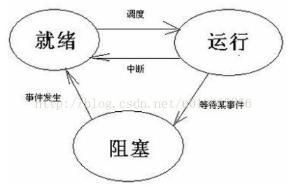

# IPC通信

进程间通信（IPC，InterProcess Communication）是指在不同进程之间传播或交换信息。

IPC的方式通常有管道（包括无名管道和命名管道）、消息队列、信号量、共享存储、Socket、Streams等。其中 Socket和Streams支持不同主机上的两个进程IPC。

## 管道

管道，通常指无名管道，是 UNIX 系统IPC最古老的形式。

### 1. 特点

1. 它是半双工的（即数据只能在一个方向上流动），具有固定的读端和写端。

2. 它只能用于具有亲缘关系的进程之间的通信（也是父子进程或者兄弟进程之间）。

3. 它可以看成是一种特殊的文件，对于它的读写也可以使用普通的read、write 等函数。但是它不是普通的文件，并不属于其他任何文件系统，并且只存在于内存中。

### 2. 原型

```cpp
1 #include <unistd.h>
2 int pipe(int fd[2]);    // 返回值：若成功返回0，失败返回-1
```

当一个管道建立时，它会创建两个文件描述符：`fd[0]`为读而打开，`fd[1]`为写而打开。如下图：


要关闭管道只需将这两个文件描述符关闭即可。

### 3. 例子

单个进程中的管道几乎没有任何用处。所以，通常调用`pipe`的进程接着调用`fork`，这样就创建了父进程与子进程之间的`IPC`通道。如下图所示：


若要数据流从父进程流向子进程，则关闭父进程的读端（fd[0]）与子进程的写端（fd[1]）；反之，则可以使数据流从子进程流向父进程。

```cpp
#include<stdio.h>
#include<unistd.h>

int main()
{
    int fd[2];  // 两个文件描述符
    pid_t pid;
    char buff[20];

    if(pipe(fd) < 0)  // 创建管道
        printf("Create Pipe Error!\n");

    if((pid = fork()) < 0)  // 创建子进程
        printf("Fork Error!\n");
    else if(pid > 0)  // 父进程
    {
        close(fd[0]); // 关闭读端
        write(fd[1], "hello world\n", 12);
    }
    else
    {
        close(fd[1]); // 关闭写端
        read(fd[0], buff, 20);
        printf("%s", buff);
    }

    return 0;
}
```

## FIFO

**FIFO**，也称为命名管道，它是一种文件类型。

### 1. 特点

1. FIFO可以在无关的进程之间交换数据，与无名管道不同。

2. FIFO有路径名与之相关联，它以一种特殊设备文件形式存在于文件系统中。

### 2. 原型

```cpp
#include <sys/stat.h>
// 返回值：成功返回0，出错返回-1
int mkfifo(const char *pathname, mode_t mode);
```

其中的`mode`参数与`open`函数中的`mode`相同。一旦创建了一个`FIFO`，就可以用一般的文件I/O函数操作它。

当`open`一个FIFO时，是否设置非阻塞标志（`O_NONBLOCK`）的区别：

* 若没有指定`O_NONBLOCK`（默认），只读 open 要阻塞到某个其他进程为写而打开此 FIFO。类似的，只写 open 要阻塞到某个其他进程为读而打开它。

* 若指定了`O_NONBLOCK`，则只读 open 立即返回。而只写 open 将出错返回 -1 如果没有进程已经为读而打开该 FIFO，其errno置ENXIO。

### 3. 例子

> FIFO的通信方式类似于在进程中使用文件来传输数据，只不过FIFO类型文件同时具有管道的特性。在数据读出时，FIFO管道中同时清除数据，并且“先进先出”。下面的例子演示了使用 FIFO 进行 IPC 的过程：

```cpp
// write_fifo.c

#include<stdio.h>
#include<stdlib.h>   // exit
#include<fcntl.h>    // O_WRONLY
#include<sys/stat.h>
#include<time.h>     // time

int main()
{
    int fd;
    int n, i;
    char buf[1024];
    time_t tp;

    printf("I am %d process.\n", getpid()); // 说明进程ID

    if((fd = open("fifo1", O_WRONLY)) < 0) // 以写打开一个FIFO
    {
        perror("Open FIFO Failed");
        exit(1);
    }

    for(i=0; i<10; ++i)
    {
        time(&tp);  // 取系统当前时间
        n=sprintf(buf,"Process %d's time is %s",getpid(),ctime(&tp));
        printf("Send message: %s", buf); // 打印
        if(write(fd, buf, n+1) < 0)  // 写入到FIFO中
        {
            perror("Write FIFO Failed");
            close(fd);
            exit(1);
        }
        sleep(1);  // 休眠1秒
    }

    close(fd);  // 关闭FIFO文件
    return 0;
}
```

```cpp
// read_fifo.c

#include<stdio.h>
#include<stdlib.h>
#include<errno.h>
#include<fcntl.h>
#include<sys/stat.h>

int main()
{
    int fd;
    int len;
    char buf[1024];

    if(mkfifo("fifo1", 0666) < 0 && errno!=EEXIST) // 创建FIFO管道
        perror("Create FIFO Failed");

    if((fd = open("fifo1", O_RDONLY)) < 0)  // 以读打开FIFO
    {
        perror("Open FIFO Failed");
        exit(1);
    }

    while((len = read(fd, buf, 1024)) > 0) // 读取FIFO管道
        printf("Read message: %s", buf);

    close(fd);  // 关闭FIFO文件
    return 0;
}
```

在两个终端里分别编译运行上面两个文件，可以看到输出结果如下：

```term
zhaohaifei@asdfasdfsa:/mnt/d/WSL/CMakeLearn/build$ cmake ..
I am 5954 process.
Send message: Process 5954's time is Mon Apr 20 12:37:28 2015
Send message: Process 5954's time is Mon Apr 20 12:37:29 2015
Send message: Process 5954's time is Mon Apr 20 12:37:30 2015
Send message: Process 5954's time is Mon Apr 20 12:37:31 2015
Send message: Process 5954's time is Mon Apr 20 12:37:32 2015
Send message: Process 5954's time is Mon Apr 20 12:37:33 2015
Send message: Process 5954's time is Mon Apr 20 12:37:34 2015
Send message: Process 5954's time is Mon Apr 20 12:37:35 2015
Send message: Process 5954's time is Mon Apr 20 12:37:36 2015
Send message: Process 5954's time is Mon Apr 20 12:37:37 2015
```

```term
zhaohaifei@asdfasdfsa:/mnt/d/WSL/CMakeLearn/build$ ./read_fifo
Read message: Process 5954's time is Mon Apr 20 12:37:28 2015
Read message: Process 5954's time is Mon Apr 20 12:37:29 2015
Read message: Process 5954's time is Mon Apr 20 12:37:30 2015
Read message: Process 5954's time is Mon Apr 20 12:37:31 2015
Read message: Process 5954's time is Mon Apr 20 12:37:32 2015
Read message: Process 5954's time is Mon Apr 20 12:37:33 2015
Read message: Process 5954's time is Mon Apr 20 12:37:34 2015
Read message: Process 5954's time is Mon Apr 20 12:37:35 2015
Read message: Process 5954's time is Mon Apr 20 12:37:36 2015
Read message: Process 5954's time is Mon Apr 20 12:37:37 2015
```

上述例子可以扩展成 客户进程—服务器进程 通信的实例，`write_fifo`的作用类似于客户端，可以打开多个客户端向一个服务器发送请求信息，`read_fifo`类似于服务器，它适时监控着FIFO的读端，当有数据时，读出并进行处理，但是有一个关键的问题是，每一个客户端必须预先知道服务器提供的FIFO接口，下图显示了这种安排：


## 消息队列

**消息队列**，是消息的链接表，*存放在内核中*。一个消息队列由一个标识符（即队列ID）来标识。

### 1. 特点

1. 消息队列是面向记录的，其中的消息具有特定的*格式*以及特定的*优先级*。

2. 消息队列*独立*于发送与接收进程。进程终止时，消息队列及其内容并不会被删除。

3. 消息队列可以实现消息的*随机查询*,消息不一定要以先进先出的次序读取,也可以按消息的类型读取。

### 2. 原型

```cpp
#include <sys/msg.h>
// 创建或打开消息队列：成功返回队列ID，失败返回-1
int msgget(key_t key, int flag);
// 添加消息：成功返回0，失败返回-1
int msgsnd(int msqid, const void *ptr, size_t size, int flag);
// 读取消息：成功返回消息数据的长度，失败返回-1
int msgrcv(int msqid, void *ptr, size_t size, long type,int flag);
// 控制消息队列：成功返回0，失败返回-1
int msgctl(int msqid, int cmd, struct msqid_ds *buf);
```

* 在以下两种情况下，`msgget`将创建一个新的消息队列：

> 1. 如果没有与键值key相对应的消息队列，并且flag中包含了`IPC_CREAT`标志位。
> 2. key参数为`IPC_PRIVATE`。

* 函数msgrcv在读取消息队列时，type参数有下面几种情况：

> 1. `type == 0`，返回队列中的第一个消息；
> 2. `type > 0`，返回队列中消息类型为 type 的第一个消息；
> 3. `type < 0`，返回队列中消息类型值小于或等于 type 绝对值的消息，如果有多个，则取类型值最小的消息。

### 3. 例子

下面写了一个简单的使用消息队列进行IPC的例子，服务端程序一直在等待特定类型的消息，当收到该类型的消息以后，发送另一种特定类型的消息作为反馈，客户端读取该反馈并打印出来。

msg_server.c

```cpp
#include <stdio.h>
#include <stdlib.h>
#include <sys/msg.h>

// 用于创建一个唯一的key
#define MSG_FILE "/etc/passwd"

// 消息结构
struct msg_form {
    long mtype;
    char mtext[256];
};

int main()
{
    int msqid;
    key_t key;
    struct msg_form msg;

    // 获取key值
    if((key = ftok(MSG_FILE,'z')) < 0)
    {
        perror("ftok error");
        exit(1);
    }

    // 打印key值
    printf("Message Queue - Server key is: %d.\n", key);

    // 创建消息队列
    if ((msqid = msgget(key, IPC_CREAT|0777)) == -1)
    {
        perror("msgget error");
        exit(1);
    }

    // 打印消息队列ID及进程ID
    printf("My msqid is: %d.\n", msqid);
    printf("My pid is: %d.\n", getpid());

    // 循环读取消息
    for(;;)
    {
        msgrcv(msqid, &msg, 256, 888, 0);// 返回类型为888的第一个消息
        printf("Server: receive msg.mtext is: %s.\n", msg.mtext);
        printf("Server: receive msg.mtype is: %d.\n", msg.mtype);

        msg.mtype = 999; // 客户端接收的消息类型
        sprintf(msg.mtext, "hello, I'm server %d", getpid());
        msgsnd(msqid, &msg, sizeof(msg.mtext), 0);
    }
    return 0;
}
```

msg_client.c

```cpp
#include <stdio.h>
#include <stdlib.h>
#include <sys/msg.h>

// 用于创建一个唯一的key
#define MSG_FILE "/etc/passwd"

// 消息结构
struct msg_form {
    long mtype;
    char mtext[256];
};

int main()
{
    int msqid;
    key_t key;
    struct msg_form msg;

    // 获取key值
    if ((key = ftok(MSG_FILE, 'z')) < 0)
    {
        perror("ftok error");
        exit(1);
    }

    // 打印key值
    printf("Message Queue - Client key is: %d.\n", key);

    // 打开消息队列
    if ((msqid = msgget(key, IPC_CREAT|0777)) == -1)
    {
        perror("msgget error");
        exit(1);
    }

    // 打印消息队列ID及进程ID
    printf("My msqid is: %d.\n", msqid);
    printf("My pid is: %d.\n", getpid());

    // 添加消息，类型为888
    msg.mtype = 888;
    sprintf(msg.mtext, "hello, I'm client %d", getpid());
    msgsnd(msqid, &msg, sizeof(msg.mtext), 0);

    // 读取类型为777的消息
    msgrcv(msqid, &msg, 256, 999, 0);
    printf("Client: receive msg.mtext is: %s.\n", msg.mtext);
    printf("Client: receive msg.mtype is: %d.\n", msg.mtype);
    return 0;
}
```

## 信号量

信号量（semaphore）与已经介绍过的IPC结构不同，它是一个计数器。信号量用于实现进程间的互斥与同步，而不是用于存储进程间通信数据。

### 1. 特点

1. 信号量用于进程间同步，若要在进程间传递数据需要结合共享内存。

2. 信号量基于操作系统的PV操作，程序对信号量的操作都是原子操作。

3. 每次对信号量的PV操作不仅限于对信号量值加1或减1，而且可以加减任意正整数。

4. 支持信号量组。

> [!NOTE]
> 操作系统的PV操作
> 
> 1. 什么时PV操作
> 
> 在操作系统中，进程是一个很要花时间理解的东西，进程通常分为就绪、运行和阻塞三个工作状态。三种状态在某些条件下可以转换，三者之间的转换关系如下：
> 
> 
> 
> 进程三个状态之间的转换就是靠PV操作来控制的。PV操作主要就是P操作、V操作和信号量。其中信号量起到了至关重要的作用。  
> 
> (1) 什么时信号量   
> 
> **信号量（semaphore）**，我们有时被称为信号灯，是在多线程环境下使用的一种设施，是可以用来保证两个或多个关键代码段不被并发调用。信号量的数据结构为一个值和一个指针，指针指向等待该信号量的下一个进程。信号量的值与相应资源的使用情况有关。   
> 
> 一般来说，信号量S＞0时，S表示可用资源的数量。执行一次P操作意味着请求分配一个单位资源，因此S的值减1；  
> 
> 当S<0时，表示已经没有可用资源，请求者必须等待别的进程释放该类资源，它才能运行下去。而执行一个V操作意味着释放一个单位资源，因此S的值加1；
> 
> 若S＝0，表示有某些进程正在等待该资源，因此要唤醒一个等待状态的进程，使之运行下去。   
> 
> **温馨贴士**：信号量的值只能由PV操作来改变。
> 
> (2) PV操作：  
>
> 自己通俗的理解， P就是请求资源，V就是释放资源。 P操作是减法运算（S:=S-1），当信号量S小于0时申请资源；V操作是加法运算（S:=+1），当信号量小于等于0时释放资源；P、V操作二者必须成对出现。
>
> 2. pv操作的意义
>
> 我们用信号量及PV操作来实现进程的同步和互斥。PV操作是属于进程的低级通信。进程的同步、互斥：
>
> **同步**: 与其说同步我更愿说”协作“，就是我们的目标只有一个，我们奔着同一个目标去的，都是在大家的努力下共同完成这么一件事情。还是比较容易理解的吧。不见得太难。
> 
> **互斥**: “千军万马过独木桥”
>
> 3. PV操作实践
>
> PV操作就是为了解决互斥和同步的问题。
>
> PV操作是分开来看的：
>
> **P操作**：使S=S-1，若S>=0，则该进程继续执行，否则该进程排入等待队列。
>
> **V操作**：使S=S+1，若S>0,唤醒等待队列中的一个进程。
>
> 下面我们通过生活中的一个司机与售票员的例子来理解：
>
>  在公共汽车上，为保证乘客的安全，司机和售票员应协调工作：停车后才能开门，关车门后才能行车。用PV操作来实现他们之间的协调。
>
> S1：是否允许司机启动汽车的变量
>
> S2：是否允许售票员开门的变量
>
> ```cpp
> driver()//司机进程
> {
>   while (1)//不停地循环
>   { 
>    P(S1);//请求启动汽车
>    启动汽车;
>    正常行车；
>    到站停车；
>    V(S2); //释放开门变量，相当于通知售票员可以开门
>   }
> }
>  
> busman()//售票员进程
> {
>    while(1)
>    {
>     关车门;
>     V(S1)；//释放开车变量，相当于通知司机可以开车
>     售票
>     P(S2)；//请求开门
>     开车门；
>     上下乘客；
>    }
> }
> ```

### 2. 原型

最简单的信号量是只能取0和1的变量，这也是信号量最常见的一种形式，叫做**二值信号量（Binary Semaphore）**。而可以取多个正整数的信号量被称为通用信号量。

Linux 下的信号量函数都是在通用的信号量数组上进行操作，而不是在一个单一的二值信号量上进行操作。

```cpp
#include <sys/sem.h>
// 创建或获取一个信号量组：若成功返回信号量集ID，失败返回-1
int semget(key_t key, int num_sems, int sem_flags);
// 对信号量组进行操作，改变信号量的值：成功返回0，失败返回-1
int semop(int semid, struct sembuf semoparray[], size_t numops);
// 控制信号量的相关信息
int semctl(int semid, int sem_num, int cmd, ...);
```

当`semget`创建新的信号量集合时，必须指定集合中信号量的个数（即`num_sems`），通常为1； 如果是引用一个现有的集合，则将`num_sems`指定为0。

在`semop`函数中，`sembuf`结构的定义如下：

```cpp
struct sembuf
{
    short sem_num; // 信号量组中对应的序号，0～sem_nums-1
    short sem_op;  // 信号量值在一次操作中的改变量
    short sem_flg; // IPC_NOWAIT, SEM_UNDO
}
```

其中`sem_op`是一次操作中的信号量的改变量：

* 若`sem_op > 0`，表示进程释放相应的资源数，将`sem_op`的值加到信号量的值上。如果有进程正在休眠等待此信号量，则唤醒它们。

* 若`sem_op < 0`，请求`sem_op`的绝对值的资源。
  * 如果相应的资源数可以满足请求，则将该信号量的值减去`sem_op`的绝对值，函数成功返回。
  * 当相应的资源数不能满足请求时，这个操作与`sem_flg`有关。
    * `sem_flg`指定`IPC_NOWAIT`，则`semop`函数出错返回`EAGAIN`。
    * `sem_flg`没有指定`IPC_NOWAIT`，则将该信号量的`semncnt`值加1，然后进程挂起直到下述情况发生:
      * 当相应的资源数可以满足请求，此信号量的`semncnt`值减1，该信号量的值减去`sem_op`的绝对值。成功返回；
      * 此信号量被删除，函数`smeop`出错返回`EIDRM`；
      * 进程捕捉到信号，并从信号处理函数返回，此情况下将此信号量的`semncnt`值减1，函数`semop`出错返回`EINTR`
      * 若`sem_op == 0`，进程阻塞直到信号量的相应值为0：
        * 当信号量已经为0，函数立即返回。
        * 如果信号量的值不为0，则依据`sem_flg`决定函数动作：
          * `sem_flg`指定`IPC_NOWAIT`，则出错返回`EAGAIN`。
          * `sem_flg`没有指定`IPC_NOWAIT`，则将该信号量的`semncnt`值加1，然后进程挂起直到下述情况发生：
            * 信号量值为0，将信号量的`semzcnt`的值减1，函数`semop`成功返回；
            * 此信号量被删除，函数`smeop`出错返回`EIDRM`；
            * 进程捕捉到信号，并从信号处理函数返回，在此情况将此信号量的`semncnt`值减1，函数`semop`出错返回`EINTR`

在`semctl`函数中的命令有多种，这里就说两个常用的：
* `SETVAL`：用于初始化信号量为一个已知的值。所需要的值作为联合semun的val成员来传递。在信号量第一次使用之前需要设置信号量。
* `IPC_RMID`：删除一个信号量集合。如果不删除信号量，它将继续在系统中存在，即使程序已经退出，它可能在你下次运行此程序时引发问题，而且信号量是一种有限的资源。

### 3. 例子

```cpp
#include<stdio.h>
#include<stdlib.h>
#include<sys/sem.h>

// 联合体，用于semctl初始化
union semun
{
    int              val; /*for SETVAL*/
    struct semid_ds *buf;
    unsigned short  *array;
};

// 初始化信号量
int init_sem(int sem_id, int value)
{
    union semun tmp;
    tmp.val = value;
    if(semctl(sem_id, 0, SETVAL, tmp) == -1)
    {
        perror("Init Semaphore Error");
        return -1;
    }
    return 0;
}

// P操作:
//    若信号量值为1，获取资源并将信号量值-1
//    若信号量值为0，进程挂起等待
int sem_p(int sem_id)
{
    struct sembuf sbuf;
    sbuf.sem_num = 0; /*序号*/
    sbuf.sem_op = -1; /*P操作*/
    sbuf.sem_flg = SEM_UNDO;

    if(semop(sem_id, &sbuf, 1) == -1)
    {
        perror("P operation Error");
        return -1;
    }
    return 0;
}

// V操作：
//    释放资源并将信号量值+1
//    如果有进程正在挂起等待，则唤醒它们
int sem_v(int sem_id)
{
    struct sembuf sbuf;
    sbuf.sem_num = 0; /*序号*/
    sbuf.sem_op = 1;  /*V操作*/
    sbuf.sem_flg = SEM_UNDO;

    if(semop(sem_id, &sbuf, 1) == -1)
    {
        perror("V operation Error");
        return -1;
    }
    return 0;
}

// 删除信号量集
int del_sem(int sem_id)
{
    union semun tmp;
    if(semctl(sem_id, 0, IPC_RMID, tmp) == -1)
    {
        perror("Delete Semaphore Error");
        return -1;
    }
    return 0;
}

int main()
{
    int sem_id;  // 信号量集ID
    key_t key;
    pid_t pid;

    // 获取key值
    if((key = ftok(".", 'z')) < 0)
    {
        perror("ftok error");
        exit(1);
    }

    // 创建信号量集，其中只有一个信号量
    if((sem_id = semget(key, 1, IPC_CREAT|0666)) == -1)
    {
        perror("semget error");
        exit(1);
    }

    // 初始化：初值设为0资源被占用
    init_sem(sem_id, 0);

    if((pid = fork()) == -1)
        perror("Fork Error");
    if(pid == 0) /*子进程*/
    {
        sleep(2);
        printf("Process child: pid=%d\n", getpid());
        sem_v(sem_id);  /*释放资源*/
    }
    else  /*父进程*/
    {
        sem_p(sem_id);   /*等待资源*/
        printf("Process father: pid=%d\n", getpid());
        sem_v(sem_id);   /*释放资源*/
        del_sem(sem_id); /*删除信号量集*/
    }
    return 0;
}
```

上面的例子如果不加信号量，则父进程会先执行完毕。这里加了信号量让父进程等待子进程执行完以后再执行。

## 共享内存

**共享内存（Shared Memory）**，指两个或多个进程共享一个给定的存储区。

### 1. 特点

1. 共享内存是最快的一种 IPC，因为进程是直接对内存进行存取。
2. 因为多个进程可以同时操作，所以需要进行同步。
3. 信号量+共享内存通常结合在一起使用，信号量用来同步对共享内存的访问。

### 2. 原型

```cpp
#include <sys/shm.h>
// 创建或获取一个共享内存：成功返回共享内存ID，失败返回-1
int shmget(key_t key, size_t size, int flag);
// 连接共享内存到当前进程的地址空间：成功返回指向共享内存的指针，失败返回-1
void *shmat(int shm_id, const void *addr, int flag);
// 断开与共享内存的连接：成功返回0，失败返回-1
int shmdt(void *addr);
// 控制共享内存的相关信息：成功返回0，失败返回-1
int shmctl(int shm_id, int cmd, struct shmid_ds *buf);
```

当用`shmget`函数创建一段共享内存时，必须指定其`size`；而如果引用一个已存在的共享内存，则将`size`指定为0。

当一段共享内存被创建以后，它并不能被任何进程访问。必须使用`shmat`函数连接该共享内存到当前进程的地址空间，连接成功后把共享内存区对象映射到调用进程的地址空间，随后可像本地空间一样访问。

`shmdt`函数是用来断开`shmat`建立的连接的。注意，这并不是从系统中删除该共享内存，只是当前进程不能再访问该共享内存而已。

`shmctl`函数可以对共享内存执行多种操作，根据参数`cmd`执行相应的操作。常用的是`IPC_RMID`（**从系统中删除该共享内存**）。

### 3. 例子

下面这个例子，使用了【共享内存+信号量+消息队列】的组合来实现服务器进程与客户进程间的通信。

* 共享内存用来传递数据；
* 信号量用来同步；
* 消息队列用来在**客户端修改了共享内存后**通知服务器读取。
