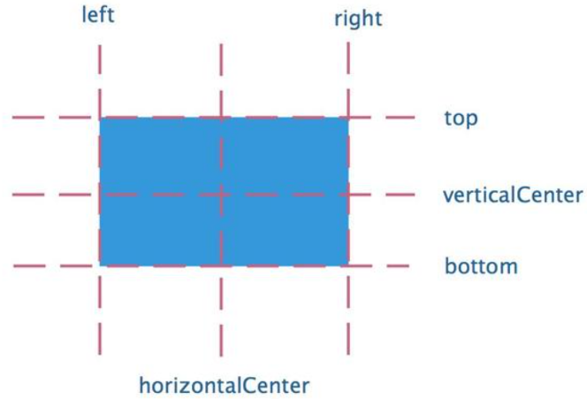

# 

# 基本语法

## 属性

* Qml中的元素使用他们的元素类型名（如Rectangle）进行声明，元素内的有本身存在的属性，也可以创建自定义属性，一个属性对应一个值，每个属性都要有属性类型和初始值

```qml
Text {
    // (1) identifier
    id: thisLabel

    // (2) set x- and y-position
    x: 24; y: 16

    // (3) bind height to 2 * width
    height: 2 * width

    // (4) custom property
    property int times: 24

    // (5) property alias
    property alias anotherTimes: thisLabel.times

    // (6) set text appended by value
    text: "Greetings " + times

    // (7) font is a grouped property
    font.family: "Ubuntu"
    font.pixelSize: 24

    // (8) KeyNavigation is an attached property
    KeyNavigation.tab: otherLabel

    // (9) signal handler for property changes
    onHeightChanged: console.log('height:', height)

    // focus is neeed to receive key events
    focus: true

    // change color based on focus value
    color: focus?"red":"black"
}
```

1. id是一个非常特殊的属性值，它在一个QML文件中被用来引用元素。id不是一个字符串，而是一个标识符和QML语法的一部分。一个id在一个QML文档中是唯一的，并且不能被设置为其它值，也无法被查询（它的行为更像C++世界里的指针）。
2. 一个属性能够设置一个值，这个值依赖于它的类型。如果没有对一个属性赋值，那么它将会被初始化为一个默认值。你可以查看特定的元素的文档来获得这些初始值的信息.
3. 一个属性能够依赖一个或多个其它的属性，这种操作称作**属性绑定**。当它依赖的属性改变时，它的值也会更新。这就像订了一个协议，在这个例子中`height`始终是`width`的两倍。
4. 添加自己定义的属性需要使用`property`修饰符，然后跟上类型，名字和可选择的初始化值（`property int times: 24`）。如果没有初始值将会给定一个系统初始值作为初始值。
> [!TIP]
> 如果属性名与已定义的默认属性名不重复，使用`default`关键字你可以将一个属性定义为默认属性。这在你添加子元素时用得着，如果他们是可视化的元素，子元素会自动的添加默认属性的子类型链表（`children property list`）。
5. 另一个重要的声明属性的方法是使用`alias`关键字（`property alias anotherTimes: thisLabel.times`）。`alias`关键字允许我们转发一个属性或者转发一个属性对象自身到另一个作用域。我们将在后面定义组件导出内部属性或者引用根级元素id会使用到这个技术。一个属性别名不需要类型，它使用引用的属性类型或者对象类型。
6. `text`属性依赖于自定义的`timers`（int整型数据类型）属性。int整型数据会自动的转换为string字符串类型数据。这样的表达方式本身也是另一种属性绑定的例子，文本结果会在`times`属性每次改变时刷新。
7. 一些属性是按组分配的属性。当一个属性需要结构化并且相关的属性需要联系在一起时，我们可以这样使用它。
8. 一些属性是元素自身的附加属性。这样做是为了全局的相关元素在应用程序中只出现一次（例如键盘输入）。
9. 对于每个元素你都可以提供一个信号操作。这个操作在属性值改变时被调用。例如这里我们完成了当`height`改变时会使用控制台输出一个信息。
10. QML提供了动态作用域的机制，后加载的文档会覆盖之前加载文档的元素id号，这样就可以引用已加载并且没有被覆盖的元素id，这有点类似创建全局变量。但不幸的是这样的代码阅读性很差。目前这个还没有办法解决这个问题，所以你使用这个机制的时候最好仔细一些甚至不要使用这种机制。如果你想向文档外提供元素的调用，你可以在根元素上使用属性导出的方式来提供。

> [!DANGER]
> 一个元素id应该只在当前文档中被引用。

## 脚本


* QML与JavaScript是最好的配合。

```qml
Text {
    id: label

    x: 24; y: 24

    // custom counter property for space presses
    property int spacePresses: 0

    text: "Space pressed: " + spacePresses + " times"

    // (1) handler for text changes
    onTextChanged: console.log("text changed to:", text)

    // need focus to receive key events
    focus: true

    // (2) handler with some JS
    Keys.onSpacePressed: {
        increment()
    }

    // clear the text on escape
    Keys.onEscapePressed: {
        label.text = ''
    }

    // (3) a JS function
    function increment() {
        spacePresses = spacePresses + 1
    }
}
```

1. 文本改变操作`onTextChanged`会将每次空格键按下导致的文本改变输出到控制台。
2. 当文本元素接收到空格键操作（用户在键盘上点击空格键），会调用JavaScript函数`increment()`。
3. 定义一个JavaScript函数使用这种格式`function (){....}`，在这个例子中是增加spacePressed的计数。每次spacePressed的增加都会导致它绑定的属性更新。

* QML的**属性绑定**与JavaScript的**=（赋值）**是不同的。绑定是一个协议，并且存在于整个生命周期。然而JavaScript赋值（=）只会产生一次效果。当一个新的绑定生效或者使用JavaScript赋值给属性时，绑定的生命周期就会结束。

```qml
Keys.onEscapePressed: {
    label.text = ''
}
```

在点击取消（ESC）后，再次点击空格键（space-bar）将不会更新我们的显示，之前的text属性绑定（`text: "Space pressed:" + spacePresses + "times"`）被销毁。

当你对改变属性的策略有冲突时（文本的改变基于一个增值的绑定并且可以被JavaScript赋值清零），类似于这个例子，你最好不要使用绑定属性。你需要使用赋值的方式来改变属性，属性绑定会在赋值操作后被销毁（销毁协议！）。

# 基本元素

元素可以被分为可视化元素与非可视化元素。可视化元素（例如矩形框Rectangle）有着几何形状并且可以在屏幕上显示。非可视化元素（例如计时器Timer）提供了常用的功能，通常用于操作可视化元素。

这里着重介绍几个基础的可视化元素，例如`Item`（基础元素对象），`Rectangle`（矩形框），`Text`（文本），`Image`（图像）和`MouseArea`（鼠标区域）。

## item

`Item`（基础元素对象）是所有可视化元素的基础对象，所有其它的可视化元素都继承自`Item`。它自身不会有任何绘制操作，但是定义了所有可视化元素共有的属性：

|分组|属性|
|---|---|
|Geometry|x,y（坐标）定义了元素左上角的位置，width，height（长和宽）定义元素的显示范围，z（堆叠次序）定义元素之间的重叠顺序。|
|Layout handling（布局操作）|anchors（锚定），包括左（left），右（right），上（top），下（bottom），水平与垂直居中（vertical center，horizontal center），与margins（间距）一起定义了元素与其它元素之间的位置关系。|
|Key handlikng（按键操作）|附加属性key（按键）和keyNavigation（按键定位）属性来控制按键操作，处理输入焦点（focus）可用操作。|
|Transformation（转换）|缩放（scale）和rotate（旋转）转换，通用的x,y,z属性列表转换（transform），旋转基点设置（transformOrigin）。|
|Visual（可视化）|不透明度（opacity）控制透明度，visible（是否可见）控制元素是否显示，clip（裁剪）用来限制元素边界的绘制，smooth（平滑）用来提高渲染质量。|
|State definition（状态定义）|states（状态列表属性）提供了元素当前所支持的状态列表，当前属性的改变也可以使用transitions（转变）属性列表来定义状态转变动画。|

> [!NOTE]
> Item（基本元素对象）通常被用来作为其它元素的容器使用，类似HTML语言中的div元素（div element）。

## Rectangle

* `Rectangle`（矩形框）是基本元素对象的一个扩展，增加了`color`来填充颜色，`border.color`（边界颜色）、`border.width`（边界宽度）来自定义边界，`radius`（半径）属性创建一个圆角矩形。

```qml
Rectangle {
    id: rect1
    x: 12; y: 12
    width: 76; height: 96
    color: "lightsteelblue"
}
Rectangle {
    id: rect2
    x: 112; y: 12
    width: 76; height: 96
    border.color: "lightsteelblue"
    border.width: 4
    radius: 8
}
```

> [!NOTE]
> 颜色命名可以使用SVG、RGB、颜色名字

* 填充的颜色与矩形的边框也支持自定义的渐变色。

```qml
Rectangle {
    id: rect1
    x: 12; y: 12
    width: 176; height: 96
    gradient: Gradient {
        GradientStop { position: 0.0; color: "lightsteelblue" }
        GradientStop { position: 0.0; color: "slategray" }
    }
    border.color: "slategray"
}
```

一个渐变色是由一系列的梯度值定义的。每一个值定义了一个位置与颜色。位置标记了y轴上的位置（0 = 顶，1 = 底）。GradientStop（倾斜点）的颜色标记了颜色的位置。

> [!DANGER]
> 一个矩形框如果没有width/height（宽度与高度）将不可见。如果你有几个相互关联width/height（宽度与高度）的矩形框，在你组合逻辑中出了错后可能就会发生矩形框不可见，请注意这一点。

> [!NOTE]
> 这个函数无法创建一个梯形，最好使用一个已有的图像来创建梯形。有一种可能是在旋转梯形时，旋转的矩形几何结构不会发生改变，但是这会导致几何元素相同的可见区域的混淆。从作者的观点来看类似的情况下最好使用设计好的梯形图形来完成绘制。


### Text

* `Text`元素用于显示文本，增加了属性值`text`（文本）与`font`（字体）来计算初始化的宽度与高度。

```qml
Text {
    text: "The quick brown fox"
    color: "#303030"
    font.family: "Ubuntu"
    font.pixelSize: 28
}
```

|Text额外属性|作用|
|---|---|
|horizontalAlignment/verticalAlignment|水平对齐/垂直对齐|
|style/styleColor|配置文字的外框效果，浮雕效果或者凹陷效果|
|elide|对于过长的文本使用省略号来表示|
|wrapMode|不想'....'省略号出现，而是通过**文字换行**显示所有的文本|

```qml
Text {
    width: 40; height: 120
    text: 'A very long text'
    // '...' shall appear in the middle
    elide: Text.ElideMiddle
    // red sunken text styling
    style: Text.Sunken
    styleColor: '#FF4444'
    // align text to the top
    verticalAlignment: Text.AlignTop
    // only sensible when no elide mode
    // wrapMode: Text.WordWrap
}
```

> [!DANGER]
> 一个没有设置宽度或者文本的文本元素（Text Element）将不可见，默认的初始宽度是0。

## Image

* Image元素用于显示各种格式的图像（例如PNG,JPG,GIF,BMP）

|Image额外属性|作用|
|---|---|
|source|文件链接路径|
|fillMode|控制元素对象的大小调整|

```qml
Image {
    x: 12; y: 12
    // width: 48
    // height: 118
    source: "assets/rocket.png"
}
Image {
    x: 112; y: 12
    width: 48
    height: 118/2
    source: "assets/rocket.png"
    fillMode: Image.PreserveAspectCrop
    clip: true
}
```

> [!NOTE]
> `PreserveAspectCrop`可以避免裁剪图像数据被渲染到图像边界外。默认情况下裁剪是被禁用的（`clip:fals`e）,需要打开裁剪（`clip:true`）来约束边界矩形的绘制。这对任何可视化元素都有效。

> [!TIP]
> 使用QQuickImageProvider你可以通过C++代码来创建自己的图像提供器，这允许你动态创建图像并且使用线程加载。详细见[QQuickImageProvider在QML设计中的应用](/02_Qt/Qml/QQuickImageProvider在QML设计中的应用.md)


## MouseArea

* `MouseArea`元素用于捕捉鼠标事件

```qml
Rectangle {
    id: rect1
    x: 12; y: 12
    width: 76; height: 96
    color: "lightsteelblue"
    MouseArea {
        id: area
        width: parent.width
        height: parent.height
        onClicked: rect2.visible = !rect2.visible
    }
}

Rectangle {
    id: rect2
    x: 112; y: 12
    width: 76; height: 96
    border.color: "lightsteelblue"
    border.width: 4
    radius: 8
}
```

# 组件 

* 组件是可以重复使用的元素。

* 一个qml文件就是一个基础组件

## 一个Button组件

```qml
// Button.qml

import QtQuick 2.0

Rectangle {
    id: root
    // export button properties
    property alias text: label.text
    signal clicked

    width: 116; height: 26
    color: "lightsteelblue"
    border.color: "slategrey"

    Text {
        id: label
        anchors.centerIn: parent
        text: "Start"
    }
    MouseArea {
        anchors.fill: parent
        onClicked: {
            root.clicked()
        }
    }
}
```

## 使用

```qml
Rectangle
{
    width: 720
    height: 480
    color: "transparent"

    Button { // our Button component
        id: button
        x: 12; y: 12
        text: "Start"
        onClicked: {
            status.text = "Button clicked!"
        }
    }

    Text { // text changes when button was clicked
        id: status
        x: 12; y: 76
        width: 116; height: 26
        text: "waiting ..."
        horizontalAlignment: Text.AlignHCenter
    }
}
```

# 位置转换

|属性|在位置转换中的功能功能|
|---|---|
|x/y|位移|
|rotation|旋转，范围[0°~360°]|
|scale|缩放;小于1缩小，大于1放大|

ClickableImage.qml 

```qml
import QtQuick 2.0

Image {
    id: root
    signal clicked

    MouseArea {
        anchors.fill: parent
        onClicked: root.clicked()
    }
}
```

transformation.qml

```qml
import QtQuick 2.0

Item {
    // set width based on given background
    width: bg.width
    height: bg.height

    Image { // nice background image
        id: bg
        source: "assets/background.png"
    }

    MouseArea {
        id: backgroundClicker
        // needs to be before the images as order matters
        // otherwise this mousearea would be before the other elements
        // and consume the mouse events
        anchors.fill: parent
        onClicked: {
            // reset our little scene
            rocket1.x = 20
            rocket2.rotation = 0
            rocket3.rotation = 0
            rocket3.scale = 1.0
        }
    }

    ClickableImage {
        id: rocket1
        x: 20; y: 100
        source: "assets/rocket.png"
        onClicked: {
            // increase the x-position on click
            x += 5
        }
    }

    ClickableImage {
        id: rocket2
        x: 140; y: 100
        source: "assets/rocket.png"
        smooth: true // need antialising
        onClicked: {
            // increase the rotation on click
            rotation += 5
        }
    }

    ClickableImage {
        id: rocket3
        x: 240; y: 100
        source: "assets/rocket.png"
        smooth: true // need antialising
        onClicked: {
            // several transformations
            rotation += 5
            scale -= 0.05
        }
    }
}
```

> [!NOTE]
> 在代码中先出现的元素有更低的堆叠顺序，因此文档中**元素的顺序**很重要。

# 定位元素

为方便观察结果，先创建一个组件

RedSquare.qml

```qml
import QtQuick 2.0

Rectangle {
    width: 48
    height: 48
    color: "red"
    border.color: Qt.lighter(color)
}
```

另外还有蓝色（blue），绿色（green），高亮（lighter）与黑暗（darker）方块，仅仅颜色不同

## Column

`Column`（列）元素将它的子对象通过顶部对齐的列方式进行排列。`spacing`属性用来设置每个元素之间的间隔大小。

```qml
import QtQuick 2.0

DarkerSquare {
    id: root
    width: 120
    height: 240

    Column {
        id: column
        anchors.centerIn: parent
        spacing: 8
        RedSquare { }
        GreenSquare { width: 96 }
        BlueSquare { }
    }
}
```

## Row

`Row`（行）元素将它的子对象从左到右，或者从右到左依次排列，排列方式取决于`layoutDirection`属性。`spacing`属性用来设置每个元素之间的间隔大小。

```qml
import QtQuick 2.0

LighterSquare {
    id: root
    width: 400; height: 120

    Row {
        id: row
        anchors.centerIn: parent
        spacing: 20
        BlueSquare { }
        GreenSquare { }
        RedSquare { }
    }
}
```

## Grid

`Grid`（栅格）元素通过设置`rows`（行数）和`columns`（列数）将子对象排列在一个栅格中。可以只限制行数或者列数。如果没有设置它们中的任意一个，栅格元素会自动计算子项目总数来获得配置，例如，设置`rows`（行数）为3，添加了6个子项目到元素中，那么会自动计算`columns`（列数）为2。属性`flow`（流）与`layoutDirection`（布局方向）用来控制子元素的加入顺序。`spacing`属性用来控制所有元素之间的间隔。

```qml
BrightSquare {
    id: root
    width: 160
    height: 160

    Grid {
        id: grid
        rows: 2
        columns: 2
        anchors.centerIn: parent
        spacing: 8
        RedSquare { }
        RedSquare { }
        RedSquare { }
        RedSquare { }
    }
}
```

## Flow

`Flow`（流）。通过`flow`（流）属性和`layoutDirection`（布局方向）属性来控制流的方向。它能够从头到底的横向布局，也可以从左到右或者从右到左进行布局。作为加入流中的子对象，它们在需要时可以被包装成新的行或者列。为了让流可以工作，**必须指定宽度或者高度**，可以通过属性直接设定，或者通过`anchor`（锚定）布局设置。

```qml
import QtQuick 2.0

BrightSquare {
    id: root
    width: 160
    height: 160

    Flow {
        anchors.fill: parent
        anchors.margins: 20
        spacing: 20
        RedSquare { }
        BlueSquare { }
        GreenSquare { }
    }
}
```

## Repeater

通常`Repeater`（重复元素）与定位器一起使用。它的工作方式就像`for`循环与迭代器的模式一样。

```qml
import QtQuick 2.0

DarkSquare {
    id: root
    width: 252
    height: 252
    property variant colorArray: ["#00bde3", "#67c111", "#ea7025"]


    Grid{
        anchors.fill: parent
        anchors.margins: 8
        spacing: 4
        Repeater {
            model: 16
            Rectangle {
                width: 56; height: 56
                property int colorIndex: Math.floor(Math.random()*3)
                color: root.colorArray[colorIndex]
                border.color: Qt.lighter(color)
                Text {
                    anchors.centerIn: parent
                    color: "#f0f0f0"
                    text: "Cell " + index
                }
            }
        }
    }
}
```

一个重复元素循环时有一个`index`（索引）属性值。当前的循环索引（0,1,2,....15）。我们可以使用这个索引值来做一些操作，例如在我们这个例子中使用`Text`（文本）显示当前索引值。

# 布局元素anchors

QML使用`anchors`对元素进行布局。`anchoring`是基础元素对象的基本属性，可以被所有的可视化QML元素使用。`anchors`就像一个协议，并且比几何变化更加强大。`Anchors`是相对关系的表达式，需要与其它元素搭配使用。


## 位置布局 

一个部件有七个锚线(anchor lines), 分别是`left`、`right`、`top`、`bottom`、`horizontalCenter`、`verticalCenter和baseline`，其中`baseline`是Text中文本的锚定基线。



## 边距

基本边距元素分别为`leftMargin`、`rightMargin`、`topMargin`、`bottomMargin`。


## 偏移

`anchor`可以设置部件的偏移，分别为`horizontalCenterOffset`, `verticalCenterOffset`和`baselineOffset`，表示水平中心的偏移、垂直中心的偏移、基线的偏移。

> [!NOTE]
> 出于性能考虑，部件只能设置锚点为同级或者直接父级。

## 几个例子

1. `fill`填充父元素

```qml
GreenSquare {
    BlueSquare {
        width: 12
        anchors.fill: parent
        anchors.margins: 8
        Text {
            anchors.centerIn: parent
            color: "#000000"
            text: '(1)'
        }
    }
}
```

2. 元素左对齐它的父元素

```qml
GreenSquare {
    BlueSquare {
        width: 48
        y: 8
        anchors.left: parent.left
        anchors.leftMargin: 8
        Text {
            anchors.centerIn: parent
            color: "#000000"
            text: '(2)'
        }
    }
}
```

3. 元素的左边与它父元素的右边对齐。

```qml
GreenSquare {
    BlueSquare {
        width: 48
        anchors.left: parent.right
        Text {
            anchors.centerIn: parent
            color: "#000000"
            text: '(3)'
        }
    }
}
```

4. 元素中间对齐。Blue1与它的父元素水平中间对齐。Blue2与Blue1中间对齐，并且它的顶部对齐Blue1的底部。

```qml
GreenSquare {
    BlueSquare {
        id: blue1
        width: 48; height: 24
        y: 8
        anchors.horizontalCenter: parent.horizontalCenter
    }
    BlueSquare {
        id: blue2
        width: 72; height: 24
        anchors.top: blue1.bottom
        anchors.topMargin: 4
        anchors.horizontalCenter: blue1.horizontalCenter
        Text {
            anchors.centerIn: parent
            color: "#000000"
            text: '(4)'
        }
    }
}
```

5. `centerIn`元素在它的父元素中居中。

```qml
GreenSquare {
    BlueSquare {
        width: 48
        anchors.centerIn: parent
        Text {
            anchors.centerIn: parent
            color: "#000000"
            text: '(5)'
        }
    }
}
```

6. 元素水平方向居中对齐父元素并向后偏移12像素，垂直方向居中对齐。

```qml
GreenSquare {
    BlueSquare {
        width: 48
        anchors.horizontalCenter: parent.horizontalCenter
        anchors.horizontalCenterOffset: -12
        anchors.verticalCenter: parent.verticalCenter
        text: '(6)'
    }
}
```

# 输入元素

## TextInput

`TextInput`允许用户输入一行文本。这个元素支持使用正则表达式验证器来限制输入和输入掩码的模式设置。

```qml
// textinput.qml

import QtQuick 2.0

Rectangle {
    width: 200
    height: 80
    color: "linen"

    TextInput {
        id: input1
        x: 8; y: 8
        width: 96; height: 20
        focus: true
        text: "Text Input 1"
    }

    TextInput {
        id: input2
        x: 8; y: 36
        width: 96; height: 20
        text: "Text Input 2"
    }
}
```

用户可以通过点击`TextInput`来改变焦点。为了支持键盘改变焦点，我们可以使用`KeyNavigation`（按键向导）这个附加属性。

```qml
// textinput2.qml

import QtQuick 2.0

Rectangle {
    width: 200
    height: 80
    color: "linen"

    TextInput {
        id: input1
        x: 8; y: 8
        width: 96; height: 20
        focus: true
        text: "Text Input 1"
        KeyNavigation.tab: input2
    }

    TextInput {
        id: input2
        x: 8; y: 36
        width: 96; height: 20
        text: "Text Input 2"
        KeyNavigation.tab: input1
    }
}
```

`KeyNavigation`附加属性可以预先设置一个元素id绑定切换焦点的按键。

TextInput只显示一个闪烁符和已经输入的文本。用户需要一些可见的修饰来鉴别这是一个输入元素，例如一个简单的矩形框。当`放置`TextInput`在其他元素中时，需要确保其它元素能够访问它导出的大多数属性。

> [!NOTE]
> 想要完整的导出`TextInput`元素，可以使用`property alias input: input`来导出这个元素。

先写一个基础组件TLineEditV1.qml

```qml
import QtQuick 2.0

Rectangle {
    width: 96; height: input.height + 8
    color: "lightsteelblue"
    border.color: "gray"

    property alias text: input.text
    property alias input: input

    TextInput {
        id: input
        anchors.fill: parent
        anchors.margins: 4
        focus: true
    }
}
```

使用TLineEditV1组件重写页面：

```qml
Rectangle {
    ...
    TLineEditV1 {
        id: input1
        ...
    }
    TLineEditV1 {
        id: input2
        ...
    }
}
```

尝试使用Tab按键来导航，你会发现焦点无法切换到input2上。这个例子中使用focus:true的方法不正确，这个问题是因为焦点被转移到input2元素时，包含TlineEditV1的顶部元素接收了这个焦点并且没有将焦点转发给TextInput（文本输入）。为了防止这个问题，QML提供了FocusScope（焦点区域）。

## FocusScope

`FocusScope`定义了如果焦点区域接收到焦点，它的最后一个使用`focus:true`的子元素接收焦点

修改TLineEditV1.qml为TLineEditV2.qml

```qml
// TLineEditV2.qml

import QtQuick 2.0

FocusScope {
    width: 96; height: input.height + 8
    Rectangle {
        anchors.fill: parent
        color: "lightsteelblue"
        border.color: "gray"

    }

    property alias text: input.text
    property alias input: input

    TextInput {
        id: input
        anchors.fill: parent
        anchors.margins: 4
        focus: true
    }
}
```

## TextEdit

`TextEdit`支持多行文本编辑，不支持文本输入的限制，提供了已绘制文本的大小查询（`paintedHeight`，`paintedWidth`）

创建组件TTextEdit.qml

```qml
// c

import QtQuick 2.0

FocusScope {
    width: 96; height: 96
    Rectangle {
        anchors.fill: parent
        color: "lightsteelblue"
        border.color: "gray"

    }

    property alias text: input.text
    property alias input: input

    TextEdit {
        id: input
        anchors.fill: parent
        anchors.margins: 4
        focus: true
    }
}
```

组件使用

```qml
import QtQuick 2.0

Rectangle {
    width: 136
    height: 120
    color: "linen"

    TTextEdit {
        id: input
        x: 8; y: 8
        width: 120; height: 104
        focus: true
        text: "Text Edit"
    }
}
```

## 按键元素

附加属性`key`允许按键操作。例如使用`up`，`down`按键来移动一个方块，`left`，`right`按键来旋转一个元素，`plus`，`minus`按键来缩放一个元素。

```qml
import QtQuick 2.0

DarkSquare {
    width: 400; height: 200

    GreenSquare {
        id: square
        x: 8; y: 8
    }
    focus: true
    Keys.onLeftPressed: square.x -= 8
    Keys.onRightPressed: square.x += 8
    Keys.onUpPressed: square.y -= 8
    Keys.onDownPressed: square.y += 8
    Keys.onPressed: {
        switch(event.key) {
            case Qt.Key_Plus:
                square.scale += 0.2
                break;
            case Qt.Key_Minus:
                square.scale -= 0.2
                break;
        }

    }
}
```