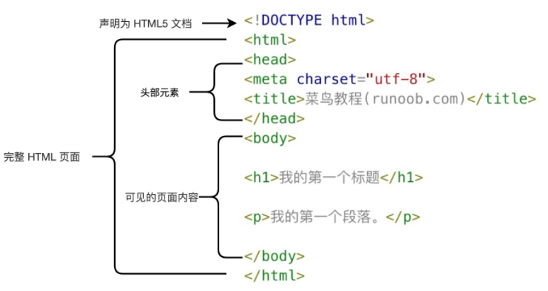

#

# 简单的一个实例

```html
<!DOCTYPE html>
<html>
<head>
<meta charset="utf-8">
<title>菜鸟教程(runoob.com)</title>
</head>
<body>
 
<h1>我的第一个标题</h1>
 
<p>我的第一个段落。</p>
 
</body>
</html>
```

解析：



* `<!DOCTYPE html>` 声明为HTML5文档
* `<html>` 元素是 HTML 页面的根元素
* `<head>` 元素包含了文档的元（meta）数据，如`<meta charset="utf-8">`定义网页编码格式为utf-8。
* `<title>` 元素描述了文档的标题
* `<body>` 元素包含了可见的页面内容
* `<h1>` 元素定义一个大标题
* `<p>` 元素定义一个段落

# 1. 元素

|开始标签|内容|结束标签|
|---|---|---|
|`<p>`|这是一个段落|`</p>`|
|`<a href="default.htm">`|这是一个链接|`</a>`|
|`<br>`|换行||

* 开始标签常被称为**起始标签（opening tag）**，结束标签常称为**闭合标签（closing tag）**。

## 元素语法
* HTML 元素以开始标签起始
* HTML 元素以结束标签终止
* 元素的内容是开始标签与结束标签之间的内容
* 某些 HTML 元素具有空内容（empty content）
* 空元素在开始标签中进行关闭（以开始标签的结束而结束）
* 大多数 HTML 元素可拥有属性

## 嵌套的 HTML 元素

大多数 HTML 元素可以嵌套（HTML 元素可以包含其他 HTML 元素）。

HTML 文档由相互嵌套的 HTML 元素构成。

# 2. 属性

> 属性是 HTML 元素提供的附加信息。

## HTML属性

* HTML 元素可以设置属性
* 属性可以在元素中添加附加信息
* 属性一般描述于开始标签
* 属性总是以名称/值对的形式出现，比如：name="value"。
  
## 实例

HTML 链接由`<a>`标签定义。链接的地址在`href`属性中指定：

```html
<a href="http://www.runoob.com">这是一个链接</a>
```

* 属性值应该始终被包括在引号内，双引号是最常用的，使用单引号也没有问题。

> [!NOTE]
> 在某些个别的情况下，比如属性值本身就含有双引号，那么您必须使用单引号，例如：
> ```html
name='John "ShotGun" Nelson'
> ```

* 属性和属性值对大小写不敏感，推荐小写的属性/属性值，新版本的 (X)HTML 要求使用小写属性。

HTML属性参考手册

|属性|描述|
|---|---|
|class|为html元素定义一个或多个类名（classname）(类名从样式文件引入)|
|id|定义元素的唯一id|
|style|规定元素的行内样式（inline style）|
|title|描述了元素的额外信息 (作为工具条使用)|

# 3. 标题

> 标题（Heading）是通过`<h1>` - `<h6>`标签进行定义的。

## html标签参考手册

|标签|描述|
|---|---|
|`<html>`|定义 HTML 文档|
|`<body>`|定义文档的主体|
|`<h1> - <h6>`|定义 HTML 标题|
|`<!--...-->`|定义注释|

# 4. 段落

> HTML 可以将文档分割为若干段落，通过`<p>`划分

* 浏览器会自动地在段落的前后添加空行。
* 即使忘了使用结束标签，大多数浏览器也会正确地将 HTML 显示出来，但忘记使用结束标签会产生意想不到的结果和错误，不建议使用。
* 使用 `<br>`标签可以不产生一个新段落的情况下进行换行（新行）
* 浏览器会移除源代码中多余的空格和空行，所有连续的空格或空行都会被算作一个空格

# 5. 文本格式化

## 文本格式化标签

|标签|描述|
|---|---|
|`<b>`|定义粗体文本|
|`<em>`|定义着重文字|
|`<i>`|斜体|
|`<small>`|小号|
|`<strong>`|变大变粗|
|`<sub>`|下标|
|`<sup>`|上标|
|`<ins>`|下划线|
|`<del>`|删除线|

## "计算机输出" 标签

|标签|描述|
|---|---|
|`<code>`|定义计算机代码|
|`<kbd>`|定义键盘码|
|`<samp>`|定义计算机代码样本|
|`<var>`|定义变量|
|`<pre>`|定义预格式文本|

## 引文, 引用, 及标签定义

|标签|描述|
|---|---|
|`<abbr>`|定义缩写|
|`<address>`|定义地址|
|`<bdo>`|定义文字方向|
|`<blockquote>`|定义长的引用|
|`<q>`|定义短的引用语|
|`<cite>`|定义引用、引证|
|`<dfn>`|定义一个定义项目|

# 6. 超链接
> HTML使用标签`<a>`来设置超文本链接。

* 超链接可以是一个字，一个词，或者一组词，也可以是一幅图像，您可以点击这些内容来跳转到新的文档或者当前文档中的某个部分。
* 当您把鼠标指针移动到网页中的某个链接上时，箭头会变为一只小手。
* 在标签`<a>`中使用了`href`属性来描述链接的地址。
* 默认情况下，链接将以以下形式出现在浏览器中：
    * 一个未访问过的链接显示为蓝色字体并带有下划线。
    * 访问过的链接显示为紫色并带有下划线。
    * 点击链接时，链接显示为红色并带有下划线。

> [!NOTE]
> 如果为这些超链接设置了 CSS 样式，展示样式会根据 CSS 的设定而显示。

## 超链接语法

* 以下是 HTML 中创建链接的基本语法和属性：`<a>`元素：创建链接的主要HTML元素是`<a>`（锚）元素。`<a>`元素具有以下属性：

    * `href`：指定链接目标的URL，这是链接的最重要属性。可以是另一个网页的URL、文件的URL或其他资源的URL。
    * `target`（可选）：指定链接如何在浏览器中打开。常见的值包括`_blank`（在新标签或窗口中打开链接）和`_self`（在当前标签或窗口中打开链接）。
    * `title`（可选）：提供链接的额外信息，通常在鼠标悬停在链接上时显示为工具提示。
    * `rel`（可选）：指定与链接目标的关系，如`nofollow`、`noopener`等。

# 7. 头部


|标签|描述|
|---|---|
|`<head>`|定义了文档的信息|
|`<title>`|定义了文档的标题|
|`<base>`|定义了页面链接标签的默认链接地址|
|`<link>`|定义了一个文档和外部资源之间的关系|
|`<meta>`|定义了HTML文档中的元数据|
|`<script>`|定义了客户端的脚本文件|
|`<style>`|定义了HTML文档的样式文件|

# 8. 样式-CSS

> CSS (Cascading Style Sheets) 用于渲染HTML元素标签的样式。

## 使用

* CSS 是在 HTML 4 开始使用的,是为了更好的渲染HTML元素而引入的.
* CSS 可以通过以下方式添加到HTML中:
  * 内联样式- 在HTML元素中使用"style" 属性
  * 内部样式表 -在HTML文档头部 <head> 区域使用<style> 元素 来包含CSS
  * 外部引用 - 使用外部 CSS 文件
* 最好的方式是通过外部引用CSS文件.