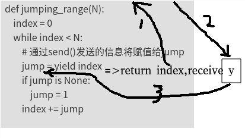
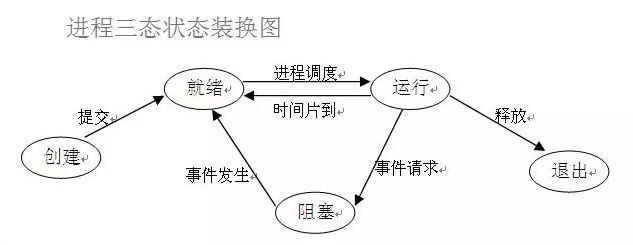
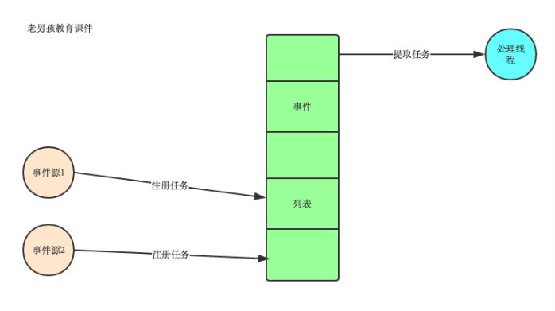
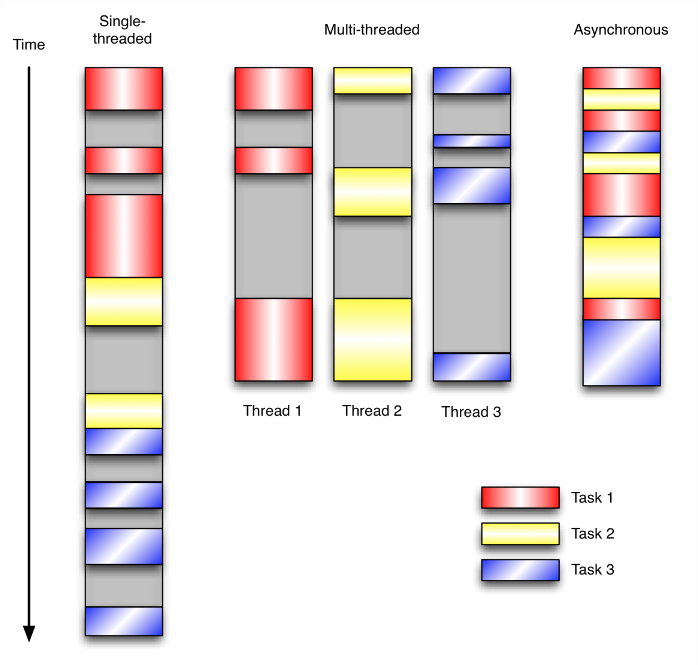

# Python语法

## 偏函数

>定义：偏函数的第二个部分(可变参数)，按原有函数的参数顺序进行补充，参数将作用在原函数上，最后偏函数返回一个新函数（类似于，装饰器decorator，对于函数进行二次包装，产生特殊效果；但又不同于装饰器，偏函数产生了一个新函数，而装饰器，可改变被装饰函数的函数入口地址也可以不影响原函数）

> 效果：固定一部分参数，在后续调用时只需传递少量参数即可

> [!NOTE]
> 个人理解为函数重构

```python
from functools import partial
 
def mod( n, m ):
  return n % m
 
mod_by_100 = partial( mod, 100 )
 
print mod( 100, 7 )  # 2
print mod_by_100( 7 )  # 2
```

## yield

### 可迭代对象、迭代器、生成器

> 可迭代对象，是其内部实现了，`__iter__`这个魔术方法。  
> 对比可迭代对象，迭代器其实就只是多了一个函数而已。就是`__next__()`，我们可以不再使用`for`循环来间断获取元素值。而可以直接使用next()方法来实现。
> 生成器，则是在迭代器的基础上（可以用`for`循环，可以使用`next()`），再实现了`yield`。

### 简单理解

#### 定义

`yield`相当于`return`，在每次`next()`，或者`for`遍历的时候，都会`yield`这里将新的值返回回去，并在这里阻塞，等待下一次的调用。记住要点，`yield`相关的2个动作和2个状态，<span style="color:green">return-自我阻塞-(别人)xx动作-唤醒(自己)</span>，完整就是,return之后，自动，自我阻塞，然后，等待xx的动作，唤醒自己。

#### 使用

```python
next()
generator.send(None)
```

> [!NOTE]
> **个人理解**：
> 1. 把yield的函数看做普通list列表
> 2. 多return时序函数   
> 

## 并发

### 基本概念

#### 进程的三种状态



```python
# 程序开始运行之后，并不是立即开始执行代码，而是会进入就绪状态，等待操作系统调度
import time
# 开始运行
print('程序开始运行')

name = input('>>>')     # 程序进入阻塞，等待用户进行输入
# 用户输入后，进入就绪状态，等待调度
print(name)             # 运行

time.sleep(1)           # 阻塞

print('程序运行结束')    # 运行
# 运行结束
```

#### 进程，线程，协程

1. 进程   
进程是具有一定独立功能的程序关于某个数据集合上的一次运行活动,进程是系统进行**资源**分配和调度的一个独立单位。每个进程都有自己的独立内存空间，不同进程通过进程间通信来通信。由于进程比较重量，占据独立的内存，所以上下文进程间的切换开销（栈、寄存器、虚拟内存、文件句柄等）比较大，但相对比较稳定安全。
2. 线程   
线程是进程的一个实体,是**CPU调度和分派**的基本单位,它是比进程更小的能独立运行的基本单位.线程自己基本上不拥有系统资源,只拥有一点在运行中必不可少的资源(如程序计数器,一组寄存器和栈),但是它可与同属一个进程的其他的线程共享进程所拥有的全部资源。线程间通信主要通过共享内存，上下文切换很快，资源开销较少，但相比进程不够稳定容易丢失数据。
3. 协程   
协程是一种**用户态的轻量级线程**，协程的调度完全由用户控制。协程拥有自己的寄存器上下文和栈。协程调度切换时，将寄存器上下文和栈保存到其他地方，在切回来的时候，恢复先前保存的寄存器上下文和栈，直接操作栈则基本没有内核切换的开销，**可以不加锁的访问全局变量**，所以上下文的切换非常快。

#### 多进程和多线程

|对比维度|多进程|多线程|总结|
|---|---|---|---|
|数据共享、同步|数据共享复杂，需要用IPC；数据是分开的，同步简单|因为共享进程数据，数据共享简单，但也是因为这个原因导致同步复杂|各有优势|
|内存、CPU|占用内存多，切换复杂，CPU利用率低|占用内存少，切换简单，CPU利用率高|线程占优|
|创建销毁、切换|创建销毁、切换复杂，速度慢|创建销毁、切换简单，速度很快|线程占优|
|编程、调试|编程简单，调试简单|编程复杂，调试复杂|进程占优|
|可靠性|进程间不会互相影响|一个线程挂掉将导致整个进程挂掉|进程占优|
|分布式|适应于多核、多机分布式；如果一台机器不够，扩展到多台机器比较简单|适应于多核分布式|进程占优|

#### 线程和协程

协程:又被称为用户级线程或绿色线程。

1. 一个线程可以多个协程，一个进程也可以单独拥有多个协程，这样python中则能使用多核CPU。
2. 线程进程都是同步机制，而协程则是异步
3. 协程能保留上一次调用时的状态，每次过程重入时，就相当于进入上一次调用的状态

#### 事件驱动

在UI编程中，常常要对鼠标点击进行相应，首先如何获得鼠标点击呢？

> 方式一：创建一个线程，该线程一直循环检测是否有鼠标点击，那么这个方式有以下几个缺点：

1. CPU资源浪费，可能鼠标点击的频率非常小，但是扫描线程还是会一直循环检测，这会造成很多的CPU资源浪费；如果扫描鼠标点击的接口是阻塞的呢？
2. 如果是堵塞的，又会出现下面这样的问题，如果我们不但要扫描鼠标点击，还要扫描键盘是否按下，由于扫描鼠标时被堵塞了，那么可能永远不会去扫描键盘；
3. 如果一个循环需要扫描的设备非常多，这又会引来响应时间的问题；

> 方式二：事件驱动模型

1. 有一个事件（消息）队列；
2. 鼠标按下时，往这个队列中增加一个点击事件（消息）；
3. 有个循环，不断从队列取出事件，根据不同的事件，调用不同的函数，如onClick()、onKeyDown()等；
4. 事件（消息）一般都各自保存各自的处理函数指针，这样，每个消息都有独立的处理函数；



事件驱动编程是一种编程范式，这里程序的执行流由外部事件来决定。它的特点是包含一个事件循环，当外部事件发生时使用回调机制来触发相应的处理。另外两种常见的编程范式是（单线程）同步以及多线程编程。

让我们用例子来比较和对比一下单线程、多线程以及事件驱动编程模型。下图展示了随着时间的推移，这三种模式下程序所做的工作。这个程序有3个任务需要完成，每个任务都在等待I/O操作时阻塞自身。阻塞在I/O操作上所花费的时间已经用灰色框标示出来了



当我们面对如下的环境时，事件驱动模型通常是一个好的选择：

1. 程序中有许多任务，而且任务之间高度独立（因此它们不需要互相通信，或者等待彼此）而且在等待事件到来时，某些任务会阻塞。
2. 当应用程序需要在任务间共享可变的数据时，这也是一个不错的选择，因为这里不需要采用同步处理。

总结：异步IO涉及到了事件驱动模型，进程中维护一个**消息队列**，当客户端又请求时，就会把请求添加到消息队列中，线程从消息队列中**轮询取要处理的请求**，遇到I/O阻塞时（操作系统处理调用I/O接口处理，与程序无关），则进行上下文切换，处理其他请求，当I/O操作完成时，调用回调函数，告诉线程处理完成，然后再切换回来，处理完成后返回给客户端

### 技术点关键词

#### GIL,线程锁

python中存在GIL这个“线程锁”，关键地方可以使用c语言解决GIL问题 然后可以提高cpu占用效率

#### 守护进程

主进程创建守护进程

1. 守护进程会在主进程代码执行结束后就终止
2. 守护进程内无法再开启子进程,否则抛出异常：AssertionError: daemonic processes are not allowed to have children

> [!NOTE]
> 进程之间是互相独立的，主进程代码运行结束，守护进程随即终止

```python
#主进程代码运行完毕,守护进程就会结束
from multiprocessing import Process
from threading import Thread
import time
def foo():
    print(123)
    time.sleep(1)
    print("end123")

def bar():
    print(456)
    time.sleep(3)
    print("end456")


p1=Process(target=foo)
p2=Process(target=bar)

p1.daemon=True
p1.start()
p2.start()
print("main-------") #打印该行则主进程代码结束,则守护进程p1应该被终止,可能会有p1任务执行的打印信息123,因为主进程打印main----时,p1也执行了,但是随即被终止
```

#### 互斥锁(mutex)

为了方式上面情况的发生，就出现了互斥锁(Lock)

```python
import threading
import time
 
 
def run(n):
    lock.acquire()  #获取锁
    global num
    num += 1
    lock.release()  #释放锁
 
lock = threading.Lock()     #实例化一个锁对象
 
num = 0
t_obj = []  
 
for i in range(20000):
    t = threading.Thread(target=run, args=("t-%s" % i,))
    t.start()
    t_obj.append(t)
 
for t in t_obj:
    t.join()
 
print(f"num:{num}")
```

#### RLock递归锁

#### 队列

Queue是多进程的安全队列，可以使用Queue实现多进程之间的数据传递。

`Queue.qsize()`：      返回当前队列包含的消息数量；   
`Queue.empty()`：      如果队列为空，返回True，反之False ；   
`Queue.full()`：       如果队列满了，返回True,反之False；   
`Queue.get()`:         获取队列中的一条消息，然后将其从列队中移除，可传参超时时长。   
`Queue.get_nowait()`： 相当Queue.get(False),取不到值时触发异常：Empty；   
`Queue.put()`:         将一个值添加进数列，可传参超时时长。   
`Queue.put_nowait()`:  相当于Queue.get(False),当队列满了时报错：Full。   

```python
from multiprocessing import Process, Queue
import time

def write(q):
   for i in ['A', 'B', 'C', 'D', 'E']:
      print('Put %s to queue' % i)
      q.put(i)
      time.sleep(0.5)

def read(q):
   while True:
      v = q.get(True)
      print('get %s from queue' % v)

if __name__ == '__main__':
   q = Queue()
   pw = Process(target=write, args=(q,))
   pr = Process(target=read, args=(q,))
   print('write process = ', pw)
   print('read  process = ', pr)
   pw.start()
   pr.start()
   pw.join()
   pr.join()
   pr.terminate()
   pw.terminate()
```

#### 管道

#### 共享数据(Manager)

```python
if __name__ == '__main__':
    with multiprocessing.Manager() as MG: #重命名
        mydict=MG.dict()#主进程与子进程共享这个字典
        mylist=MG.list(range(5))#主进程与子进程共享这个LIST

        p=multiprocessing.Process(target=func,args=(mydict,mylist))

        p.start()
        p.join()

        print(mylist)
        print(mydict)
```

#### 信号量

#### 事件

python线程的事件用于主线程控制其他线程的执行，事件是一个简单的线程同步对象，其主要提供以下几个方法：

|方法|注释|
|---|---|
|`clear`|将`flag`设置为`False`|
|`set`|将`flag`设置为`True`|
|`is_set`|判断是否设置了`flag`|
|`wait`|会一直监听`flag`，如果没有检测到`flag`就一直处于阻塞状态|

事件处理的机制：全局定义了一个`Flag`，当flag值为`False`，那么`event.wait()`就会阻塞，当`flag`值为`True`，那么`event.wait()`便不再阻塞。

```python
#利用Event类模拟红绿灯
import threading
import time
 
event = threading.Event()
  
def lighter():
    count = 0
    event.set()     #初始值为绿灯
    while True:
        if 5 < count <=10 :
            event.clear()  # 红灯，清除标志位
            print("\33[41;1mred light is on...\033[0m")
        elif count > 10:
            event.set()  # 绿灯，设置标志位
            count = 0
        else:
            print("\33[42;1mgreen light is on...\033[0m")
 
        time.sleep(1)
        count += 1
 
def car(name):
    while True:
        if event.is_set():      #判断是否设置了标志位
            print("[%s] running..."%name)
            time.sleep(1)
        else:
            print("[%s] sees red light,waiting..."%name)
            event.wait()
            print("[%s] green light is on,start going..."%name)
 
light = threading.Thread(target=lighter,)
light.start()
 
car = threading.Thread(target=car,args=("MINI",))
car.start()
```

#### fork

Unix/Linux操作系统提供了一个`fork()`系统调用，它非常特殊。普通的函数调用，调用一次，返回一次，但是`fork()`调用一次，返回两次，因为操作系统自动把当前进程（称为父进程）复制了一份（称为子进程），然后，分别在父进程和子进程内返回。

子进程永远返回0，而父进程返回子进程的ID。这样做的理由是，一个父进程可以`fork`出很多子进程，所以，父进程要记下每个子进程的ID，而子进程只需要调用`getppid()`就可以拿到父进程的ID。

Python的`os`模块封装了常见的系统调用，其中就包括`fork`，可以在Python程序中轻松创建子进程

```python
import os

print('Process (%s) start...' % os.getpid())
# Only works on Unix/Linux/Mac:
pid = os.fork()
if pid == 0:
    print('I am child process (%s) and my parent is %s.' % (os.getpid(), os.getppid()))
else:
    print('I (%s) just created a child process (%s).' % (os.getpid(), pid))
```


运行结果如下：

> Process (876) start...   
> I (876) just created a child process (877).   
> I am child process (877) and my parent is 876.   

#### Process模块

1. 注意：`Process`对象可以创建进程，**但`Process`对象不是进程，其删除与否与系统资源是否被回收没有直接的关系。**
2. 主进程执行完毕后会默认等待子进程结束后回收资源，不需要手动回收资源；`join()`函数用来控制子进程结束的顺序,其**内部也有一个清除僵尸进程的函数，可以回收资源；**
3. `Process`进程创建时，子进程会将主进程的`Process`对象完全复制一份，这样在主进程和子进程各有一个`Process`对象，**但是`p.start()`启动的是子进程，主进程中的`Process`对象作为一个静态对象存在，不执行。**
4. 当**子进程执行完毕后，会产生一个僵尸进程，其会被join()函数回收**，或者再有一条进程开启，**`start`函数也会回收僵尸进程**，所以不一定需要写`join`函数。
5. windows系统在子进程结束后会立即自动清除子进程的`Process`对象，而linux系统子进程的`Process`对象如果没有`join`函数和`start`函数的话会在主进程结束后统一清除。
6. 进程直接的内存空间是隔离的

```python
from multiprocessing import Process
n=100
def work():
    global n
    n=0
    print('子进程内: ',n)


if __name__ == '__main__':
    p=Process(target=work)
    p.start()
    print('主进程内: ',n)
```

#### multiprocessing模块

`Process`模块是一个创建进程的模块,借助这个模块可以创建进程

```python
Process([group [, target [, name [, args [, kwargs]]]]]) #由该类实例化得到的对象，表示一个子进程中的任务（尚未启动）
```

> 强调：

1. 需要使用关键字的方式来指定参数
2. `args`指定的为传给`target`函数的位置参数，是一个元组形式，必须有逗号

> 参数介绍：

1. `group`参数未使用，值始终为`None`
2. `target`表示调用对象，即子进程要执行的任务
3. `args`表示调用对象的位置参数元组，`args=(1,2,'egon',)`
4. `kwargs`表示调用对象的字典,`kwargs={‘name’:’egon’,’age’:18}`
5. `name`为子进程的名称

> 方法介绍

1. `p.start()`：启动进程，并调用该子进程中的`p.run()`
2. `p.run()`: 进程启动时运行的方法，正是它去调用`target`指定的函数，我们自定义类的类中一定要实现该方法
3. `p.terminate()`: 强制终止进程`p`，不会进行任何清理操作，如果`p`创建了子进程，该子进程就成了僵尸进程，使用该方法需要特别小心这种情况。如果p还保存了一个锁那么也将不会被释放，进而导致死锁
4. `p.is_alive()`: 如果p仍然运行，返回`True`
5. `p.join([timeout])`: 主线程等待`p`终止（强调：是主线程处于等的状态，而p是处于运行的状态）。`timeout`是可选的超时时间，需要强调的是，`p.join`只能`join`住`start`开启的进程，而不能join住run开启的进程

> 属性介绍

### 其他问题

### 生产者消费者

这也是实际项目中使用较多的一种并发模式，用`Queue`(`JoinableQueue`)实现，是Python中最常用的方式(这里的`queue`特指`multiprocess`包下的`queue`，非`queue.Queue`)。

#### `Queue`

```python
# encoding:utf-8
__author__ = 'Fioman'
__time__ = '2019/3/7 14:06'
from multiprocessing import Process,Queue
import time,random

def consumer(q,name):
    while True:
        food = q.get()
        if food is None:
            print('接收到了一个空,生产者已经完事了')
            break

        print('\033[31m{}消费了{}\033[0m'.format(name,food))
        time.sleep(random.random())

def producer(name,food,q):
    for i in range(10):
        time.sleep(random.random())
        f = '{}生产了{}{}'.format(name,food,i)
        print(f)
        q.put(f)

if __name__ == '__main__':
    q = Queue(20)
    p1 = Process(target=producer,args=('fioman','包子',q))
    p2 = Process(target=producer,args=('jingjing','馒头',q))
    p1.start()
    p2.start()

    c1 = Process(target=consumer,args=(q,'mengmeng'))
    c2 = Process(target=consumer,args=(q,'xiaoxiao'))
    c1.start()
    c2.start()

    # 让主程序可以等待子进程的结束.
    p1.join()
    p2.join()
    # 生产者的进程结束,这里需要放置两个空值,供消费者获取,用来判断已经没有存货了
    q.put(None)
    q.put(None)

    print('主程序结束..........')
```

#### `JoinableQueue`

创建可连接的共享进程队列,`JoinableQueue`也是队列,但是这些队列比较特殊.它们可以允许消费者通知生产者项目已经被成功处理.注意,这里必须是生产者生产完了,生产者的进程被挂起,等到消费者完全消费的时候,生产者进程就结束,然后主程序结束.将消费者进程设置为守护进程,这样的话,主进程结束的时候,消费进程也就结束了.

```python
q.task_done() 
使用者使用此方法发出信号，表示q.get()返回的项目已经被处理。如果调用此方法的次数大于从队列中删除的项目数量，将引发ValueError异常。

q.join() 
生产者将使用此方法进行阻塞，直到队列中所有项目均被处理。阻塞将持续到为队列中的每个项目均调用q.task_done()方法为止。 
# encoding:utf-8
__author__ = 'Fioman'
__time__ = '2019/3/7 14:06'
from multiprocessing import Process,JoinableQueue
import time,random

def consumer(q,name):
    while True:
        food = q.get()
        if food is None:
            print('接收到了一个空,生产者已经完事了')
            break

        print('\033[31m{}消费了{}\033[0m'.format(name,food))
        time.sleep(random.random())
        q.task_done()  # 向生产者发送信号,表示消费了一个

def producer(name,food,q):
    for i in range(10):
        time.sleep(random.random())
        f = '{}生产了{}{}'.format(name,food,i)
        print(f)
        q.put(f)
    q.join() # 当生产者生产完毕之后,会在这里阻塞.等待消费者的消费.


if __name__ == '__main__':
    q = JoinableQueue(20)
    p1 = Process(target=producer,args=('fioman','包子',q))
    p2 = Process(target=producer,args=('jingjing','馒头',q))
    p1.start()
    p2.start()

    c1 = Process(target=consumer,args=(q,'mengmeng'))
    c2 = Process(target=consumer,args=(q,'xiaoxiao'))
    c1.daemon = True # 将消费者设置为守护进程
    c2.daemon = True # 将消费者设置为守护进程
    c1.start()
    c2.start()

    # 让主程序可以等待生产子进程的结束.
    p1.join()
    p2.join()


    print('主程序结束..........')
```