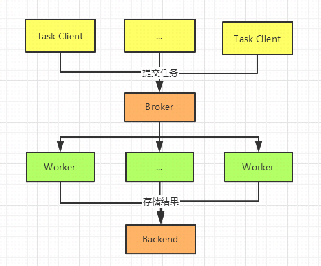
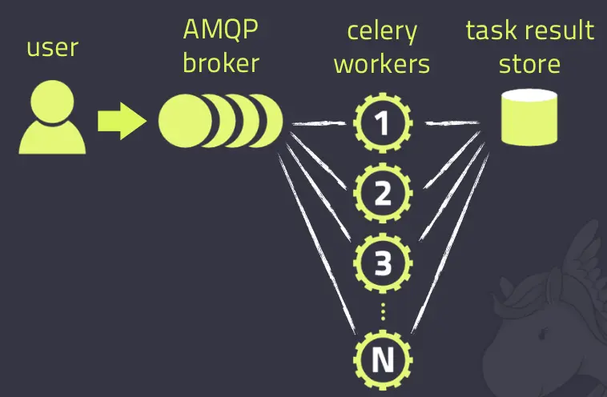

# celery

**Celery是一个简单、灵活且可靠的，处理大量消息的分布式系统，专注于实时处理的异步任务队列，同时也支持任务调度。**

Celery的架构由三部分组成，**消息中间件（message broker），任务执行单元（worker）和任务执行结果存储（task result store）**组成。

> 消息中间件

Celery本身不提供消息服务，但是可以方便的和第三方提供的消息中间件集成。包括，RabbitMQ, Redis等等

> 任务执行单元

Worker是Celery提供的任务执行的单元，worker并发的运行在分布式的系统节点中。

> 任务结果存储  

Task result store用来存储Worker执行的任务的结果，Celery支持以不同方式存储任务的结果，包括AMQP, redis等

另外， Celery还支持不同的并发和序列化的手段

并发：Prefork, Eventlet, gevent, threads/single threaded
序列化：pickle, json, yaml, msgpack. zlib, bzip2 compression， Cryptographic message signing 等等

