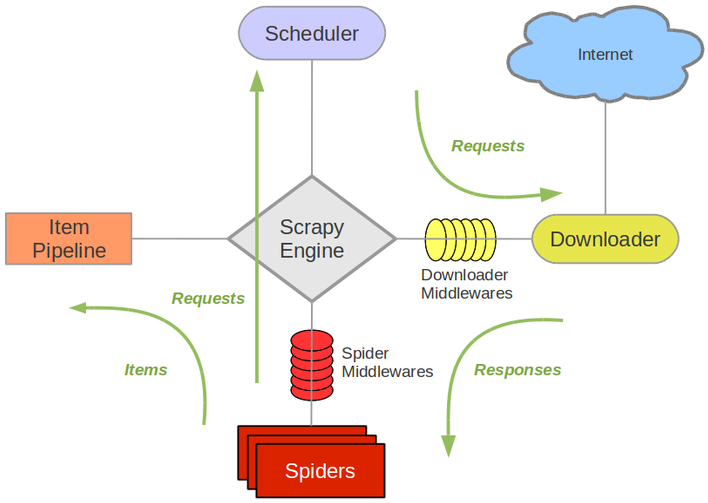

#

# 1. Scrapy框架简介

## 概述

> Scrapy 是用 Python 实现的一个为了爬取网站数据、提取结构性数据而编写的应用框架。
> Scrapy 常应用在包括数据挖掘，信息处理或存储历史数据等一系列的程序中。
> 通常我们可以很简单的通过 Scrapy 框架实现一个爬虫，抓取指定网站的内容或图片。

## 组件



* **Scrapy Engine**(引擎): 负责Spider、ItemPipeline、Downloader、Scheduler中间的通讯，信号、数据传递等。
* **Scheduler**(调度器): 它负责接受引擎发送过来的Request请求，并按照一定的方式进行整理排列，入队，当引擎需要时，交还给引擎。
* **Downloader**（下载器）：负责下载Scrapy Engine(引擎)发送的所有Requests请求，并将其获取到的Responses交还给Scrapy Engine(引擎)，由引擎交给Spider来处理，
* **Spider**（爬虫）：它负责处理所有Responses,从中分析提取数据，获取Item字段需要的数据，并将需要跟进的URL提交给引擎，再次进入Scheduler(调度器).
* **Item Pipeline**(管道)：它负责处理Spider中获取到的Item，并进行进行后期处理（详细分析、过滤、存储等）的地方。
* **Downloader Middlewares**（下载中间件）：你可以当作是一个可以自定义扩展下载功能的组件。
* **Spider Middlewares**（Spider中间件）：你可以理解为是一个可以自定扩展和操作引擎和Spider中间通信的功能组件（比如进入Spider的Responses;和从Spider出去的Requests）

> [!WARNING]
> 只有当调度器中不存在任何request了，整个程序才会停止，（也就是说，对于下载失败的URL，Scrapy也会重新下载。）

## 数据处理流程
1. 引擎从调度器中取出一个链接(URL)用于接下来的抓取
2. 引擎把URL封装成一个请求(Request)传给下载器
3. 下载器把资源下载下来，并封装成应答包(Response)
4. 爬虫解析Response
5. 解析出实体（Item）,则交给实体管道进行进一步的处理
6. 解析出的是链接（URL）,则把URL交给调度器等待抓取

# 2. 创建项目

创建项目

```term
(python35) PS C:\Users\zhaohaifei5.HIK\Desktop\Scrapy测试>$ scrapy startproject test_01
(python35) PS C:\Users\zhaohaifei5.HIK\Desktop\Scrapy测试>$ scrapy genspider douban douban.com
```

# 3. 下载中间件

> 主要用于拦截请求

# 重试

