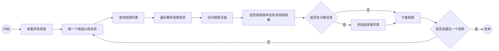

# 移动端抓包

## 1. 抓包工具

### fiddler

`Fiddler`是一个通过代理的方式来进行抓包工具，运行时会在本地建立一个代理服务。

> [!NOTE]
> 配置本机代理，IE的代理自动变成工具配置的， 谷歌和火狐则需要 手动设置代理。

#### Fiddler工作原理

```mermaid
graph LR
    A((开始))-->B[收集所有频道]
    B-->C[取一个频道ID及名称]
    C-->D[查询视频列表]
    D-->E[遍历解析视频信息]
    E-->F[访问视频页面]
    F-->G[监控视频基本信息和视频链接]
    G-->H{是否有分集信息}
    H--是-->I[添加值采集列表]
    H--否-->J[下载视频]
    I-->J
    J-->K{是否是最后一个视频}
    K--是-->L((结束))
    K--否-->C
```

#### 