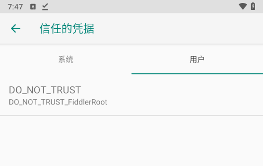
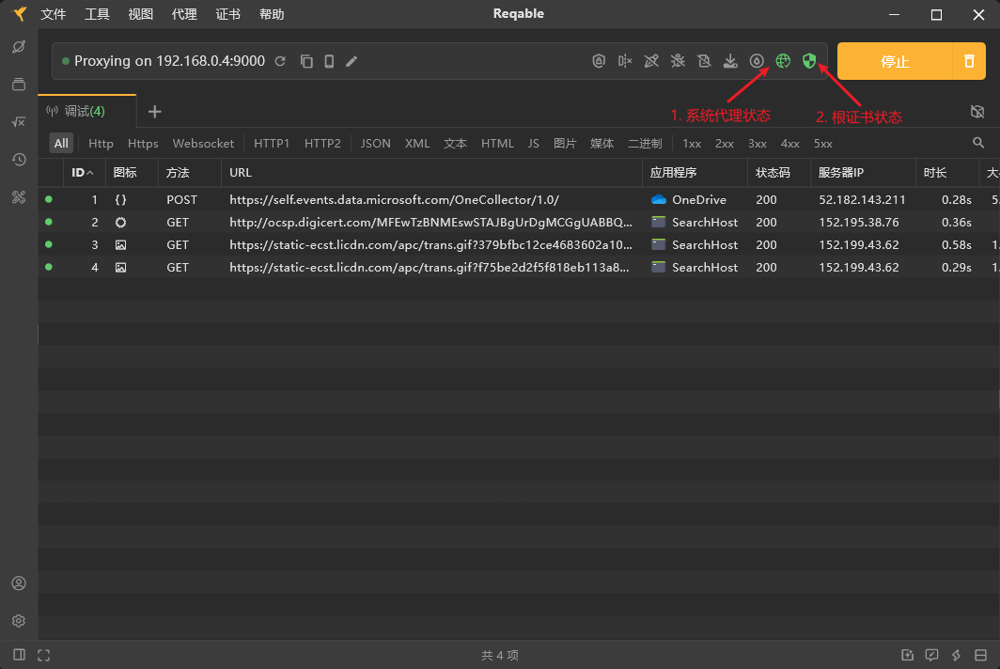

# 移动端抓包

## fiddler

`Fiddler`是一个通过代理的方式来进行抓包工具，运行时会在本地建立一个代理服务。

> [!NOTE]
> 配置本机代理，IE的代理自动变成工具配置的， 谷歌和火狐则需要 手动设置代理。

### ① Fiddler工作原理

* 原本正常访问网页或App路径是：**客户端 ---> 目标服务器**
* Fiddler抓包就是客服端和目标服务器之间加入了一个代理，**客户端 ---> 媒人（代理）--->目标服务器**
* 只有这三者产生一定的联系，才能进行拦截/抓取一些东西，客户端先访问代理，代理把客户端的信息记录下来，再去联系目标服务器，进而返回给客户端。

### ② PC端抓包

#### 配置

按照`Tools---> Options`配置Options，主要配置**HTTPS**，**Connections**信息. 第一次配置会出现安装证书的请求，一路点击**是**, 配置完毕一定需要重启Fiddler,否则配置失效

**HTTPS配置**：打开`Capture HTTPS CONNECTs`，`Decrypt HTTPS traffic`和`Ignore server certificate errors`，下拉框按需选择

**Connections配置**：配置端口以及允许远程抓包，用于允许电脑或手机连接到Fiddler

> [!NOTE]
> 旧版的Fiddler还需要自行配置电脑的网络代理，新版的每次启动会自动配置

#### 抓包

配置完成后可直接抓包，这里介绍一下工具的筛选功能

* 内外网过滤
* Host过滤
* `Client Process`进程过滤
* `Request Headers`请求头过滤
* `Breakpoints`请求类型过滤并设置断点
* `Response Status Code`响应状态码过滤
* `Response Type and Size`响应类型和大小过滤
* `Response Headers`响应头过滤

* Run Filterset now :马上执行过滤，立即生效过滤
* Load Filterset：加载本地过滤文件到fiddler
* Save Filterset ：保存fiddler过滤条件到本地

## 移动端抓包

### 代理连接PC端Fiddler

#### 配置安全证书

1. 电脑和手机必须在用一个网络中，手机打开浏览器访问地址 电脑ip:配置的端口号, 下载安装证书

2. 安装证书

   * 打开手机设置 ---> 系统安全 ---> 凭据存储 ---> 从SD卡安装
   * 选择刚刚下载的FiddlerRoot.cer文件安装
   * 验证是否安装成功：点击信任的凭据 ---> 用户，看是否安装成功。   

> [!NOTE]
> 安卓7以前可以直接安装

3. 配置手机wifi代理。寻到与电脑同样的wifi，配置信息. 长按wifi，进入配置信息，找到代理,选择手动,进行配置

#### 采集示例

[采集示例](../../../image/手机代理-Fiddler.mp4)

#### 特殊情况

以抖音为例，手机端设置代理后会报网络错误，但是右侧抓到的其他包返回值都是200，并不网络问题

   

这个是因为部分安卓软件运行时会检测是否开启代理，这里尝试用`Drony`app将代理伪装成SVN，可以成功实现抓包（8月份可用，写文档调式时不会报网络连接失败，但是抓不到包）

> Drony配置：

1. 转到setting，选择wifi，选中与PC相同的wifi进行配置

2. 配置host与端口号后，`Proxy Type`选择`Manual`后，下拉配置规则

3. 配置规则界面`Action`选择`Local proxy chain`，在配置要抓包的应用后启动即可抓包

### Reqable

工具可直接在官网下载，分[windows端](https://reqable.com/zh-CN/windows)、[MACOS端](https://reqable.com/zh-CN/macos)、[Linux端](https://reqable.com/zh-CN/linux)，[Android端](https://reqable.com/zh-CN/android)、[iOS端](https://reqable.com/zh-CN/ios)，工具基本可以看作是**Fiddler + Charles + Postman**，主要是3块功能：

### API调试（抓包）

1. 安装CA根证书
2. 启动系统代理状态

### API测试（Postman）

#### 新建API调试

1. 点击标签栏的`+`按钮，新建一个API会话

2. 在新标签页输入参数并点击`发送`按钮，等待请求结果

### 协同模式（移动端流量转发到PC端Reqable进行分析和实施各种调试操作）

1. 移动端安装证书

<table>
    <tr>
        <td >

</td>
        <td >

</td>
        <td >

</td>
        <td >

 </td>
        <td >

 </td>
    </tr>
</table>

2. 扫码连接PC端

3. 调试

