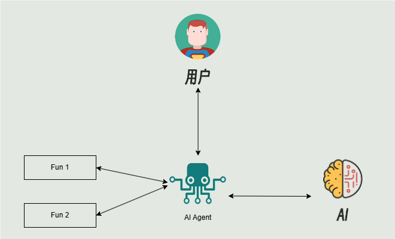
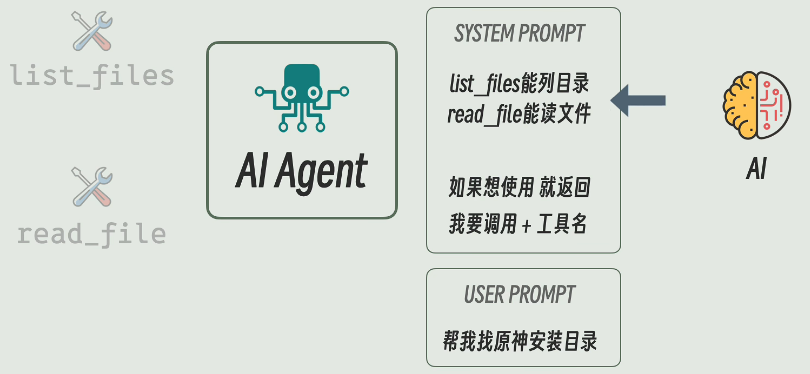
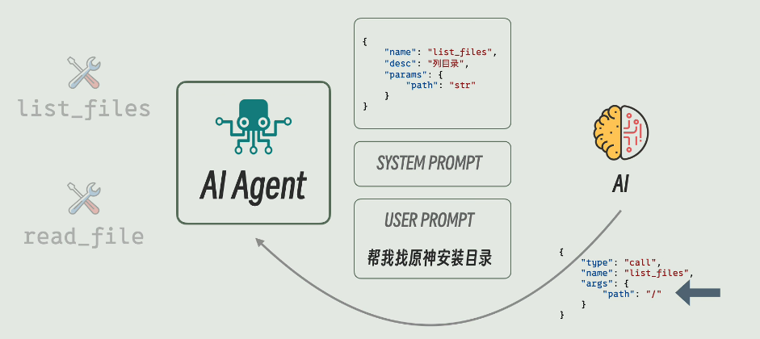
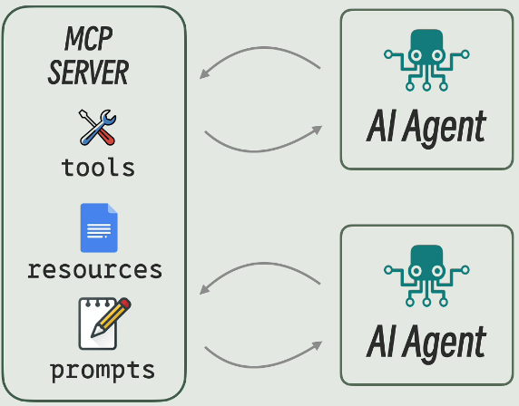
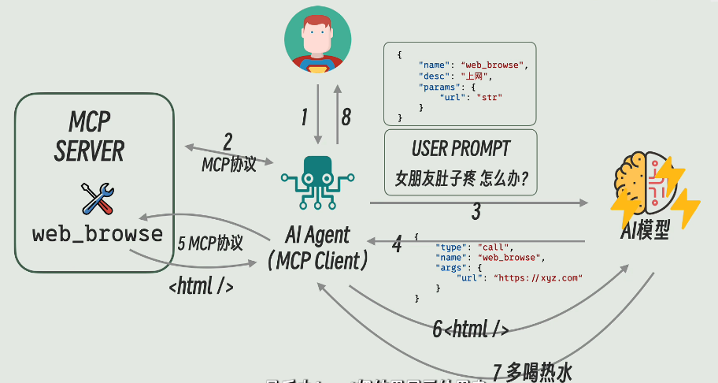

# AI preview

## prompt, agent, and MCP

### prompt

### AI Agent

**负责在模型、工具和用户之间传话的程序**

提供给AI调用的函数或者服务是`AI Tools`

#### system prompt:

#### function calling: **统一格式，规范描述**

#### AI Agent和AI Tools之间怎么通信？

1. AI Agent和AI Tools写在同一个程序里，直接函数调用
2. Tool作为服务有Agent统一进行调用，这就是`MCP`

### MCP

### 总结

