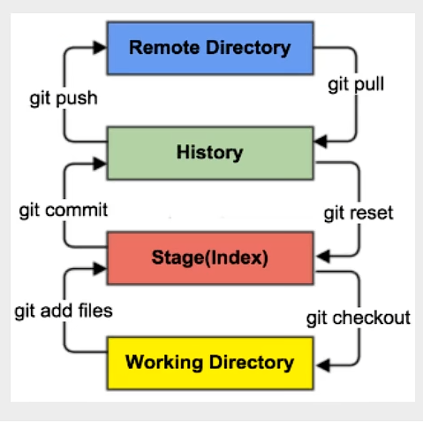
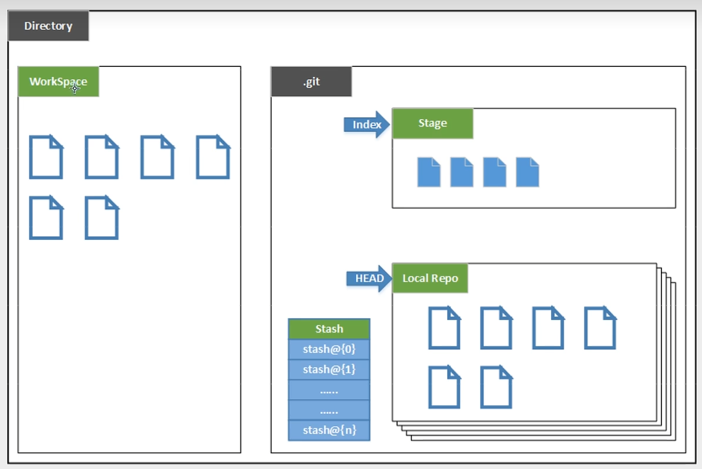
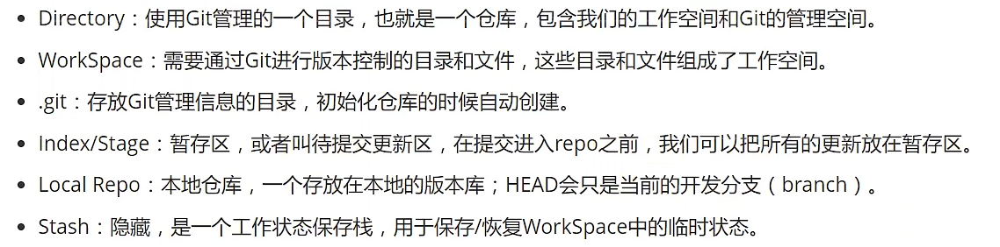
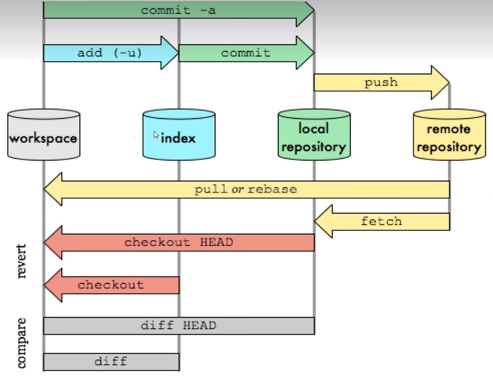
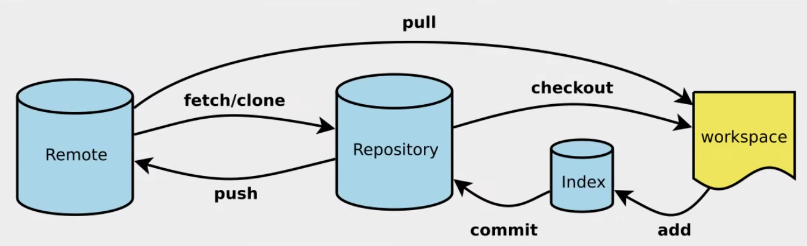

# 版本控制
> 版本迭代，管理多人开发的技术

* 实现跨区域多人协同开发
* 追踪和记载一个或多个文件的历史记录
* 组织和保护你的源代码和文档
* 统计工作量
* 并行开发、提高开发效率
* 跟踪记录整个软件的开发过程
* 减轻开发人员的负担，节省时间，同时降低人为错误

> 常见的版本控制工具

* Git
* SVN
* VSS
* TFS
* Visual Studio Online

> 版本控制分类

**1、本地版本控制**

记录文件每次的更新，可以对每个版本做一个快照，或是记录补丁文件，适合个人用，如RCS   


**2、集中版本控制**

所有的版本数据都保存在服务器上，协同开发者从服务器上同步更新或者上传自己的修改   
   
所有的版本数据都在服务器上，用户的本地只有自己以前的版本，如果不联网的话，用户就看不到历史的版本，也不能切换版本验证问题，或者在不同分支下工作。而且，所有的数据都保存在单一的服务器上，有很大的分线这个服务器会坏，这样就会丢失所有的数据，当然可以定期备份。代表产品：SVN、CVS、VSS   

**3、分布式版本控制**

所有的版本信息仓库全部同步到本地的每个用户，这样就可以在本地查看所有的版本历史，可以离线在本地提交，只需在联网时push到相应的服务器或者其他用户那里。由于每个用户那里保存的都是所有的版本数据，只要由一个用户的设备没有问题就可以恢复所有的数据，但这增加了本地存储空间的占用。代表作品：Git   
不会因为服务器损坏或者网络问题，造成不能工作的情况   


> Git和SVN的主要区别

SVN是集中式版本控制系统

Git是分布式版本控制系统

# Git环境配置

> 软件下载  

[Git官网](https://git-scm.com)   
[淘宝镜像下载](http://npm.taobao.org/mirrors/)   
[清华大学开源镜像网站](https://mirrors.tuna.tsinghua.edu.cn/)

> 先卸载

直接反安装即可、清理环境变量、卸载   
下载对应的版本即可安装   
安装：无脑下一步即可！安装完毕即可使用

> 启动Git

安装成功后在开始菜单中会有Git项，菜单下有3个程序：  
Git Bash:Unix和Linux风格的命令行，使用最多，推荐最多  
Git CMD :Winsows风格的命令行  
Git GUI :图形界面的Git，不建议初学者使用，尽量先熟悉常用的命令

> 基本Linux命令

1. cd: 改变目录
2. cd..: 回退到上一个目录，直接cd进入默认目录
3. pwd: 显示当前所在的目录路径
4. ls(ll): 都是列出当前目录中的所有文件，只不过(ll)会更详细
5. touch: 新建一个文件，如`touch index.js`就会在当前目录下新建一个index.js文件
6. rm: 删除一个文件，如`rm index.js`就会把当前目录下的index.js文件删除 
7. mkdir: 新建一个目录，就是新建一个文件夹
8. rm -r: 删除一个文件夹，`rm -r src`就是删除当前目录下的src文件夹  
   `rm -rf /` 强制删除根目录，不要手贱
9.  mv: 移动文件，`mv index.html src`，index.html是我们要移动的文件，src是目标文件夹，这样写，必须目标文件和目标文件夹在同一目录下
10. reset: 重新初始化终端/清屏。
11. clear: 清屏
12. history: 查看命令历史
13. help: 帮助
14. exit: 退出
15. #: 表示注释

> Git配置

* ` git config -l`              查看Git配置
* ` git config --system --list` 查看系统配置
* `git config --global --list`  查看当前用户配置

**Git相关的配置文件**

1. Git\etc\gitconfig:         Git安装目录下的Gitconfig  --system系统级
2. c:\Users\Administraror\.gitconfig: 只适用于当前登录用户的配置 --global全局

这里可以直接编辑配置文件，通过命令设置后会响应到这里

> 设置用户名与邮箱（用户标识，必要）

`git config --global user.name "用户名"` 设置用户名   
`git config --global user.email "邮箱"`  设置邮箱

# Git基本理论

> 工作区域

Git本地有三个工作区域：工作目录（Working Directory）、暂存区（Stage/Index）、资源库（Repository或Git Directory）。如果在加上远程的Git仓库（Remote Directory）既可以分为四个工作区域。文件在这四个区域之间的转换关系如下所示：   


* Workspace:   工作区，平时放代码的地方
* Index/Stage: 暂存区，用于临时存放你的改动，事实上它只是一个文件，保存及将提交的文件列表信息
* Repository:  本地仓库区，就是安全存放数据的地方，这里有提交的所有的版本的数据。其中HEAD指向最新放入仓库的版本
* Remote:      远程仓库，托管代码的服务器，可以简单的认为是项目组中的一台电脑用于远程数据交换

本地的三个区域确切的叔应该是git仓库中HJEAD指向的版本   
   


> 工作流程

Git的工作流程一般是这样的：  
1. 在工作目录中添加、修改文件；
2. 将需要进行版本管理的文件放入暂存区域；
3. 将暂存区域的文件提交到Git仓库。
   
因此，Git管理的文件有三种状态：已修改（Modigied）、已暂存（staged）、已提交（committed）  
  

# Git项目搭建

> 创建项目目录与常用指令

工作目录（workspace）一般就是希望Git帮你管理的文件夹，可以是项目的目录，也可以是一个空目录，建议不要有中文。日常只需要记住下图6个命令：   


> 本地仓库搭建

创建本地仓库的方法有两种：一是创建全新的仓库，另一种是克隆远程仓库
1. 创建全新的仓库，需要使用Git管理的项目的根目录执行：
   ```bash
   # 在当前的目录新建一个Git代码库
   $ git init
   ```

2. 执行后可以看到，仅仅在项目目录中多出了一个.git目录，关于版本等的所有信息都在这个目录里边

> 克隆远程仓库

1. 另一种方法是克隆远程目录，将远程服务器上的仓库完全镜像一份至本地
   ```bash
   # 克隆一个项目和它的整个代码历史（版本信息）
   $ git clone [url]
   ```

2. 可以去gitee或者github上试一试

# Git文件操作

> 文件4种状态

版本控制就是对文件版本的控制，逍遥对文件进行修改、提交等操作，首先要知道文件当前在什么状态，不然可能提交了现在还不想提交的文件，或者要提交的文件没有提交上

* **Untracked** 未跟踪，此文件在文件夹中，单并没有加入到Git库，不参与版本控制。通过`git add`状态变为***Staged***
* **Unmodify** 文件已入库，未修改，即版本中的文件快照内容与文件夹中完全一致。这种文件有两种去处，如果他被修改，而变为***Modified***。如果使用`git rm`移除版本库，则成为***Untracked***文件
* **Modified** 文件已修改，仅仅是修改，并没有进行其他的操作。这个文件也有两个去处，通过`git add`可进入***Straged***状态，使用`git checkout`则丢弃修改过，返回到`Unmodify`状态，这个`git checkout`即从库中去处文件，覆盖当前修改
* **Staged** 暂存状态。执行`git commit`则将修改同步到文件库中，这是库中的文件和本地文件又变为一直，文件为***Unmodify***状态。执行`git reset HEAD filename`取消暂存，文件状态为***Modified***

> 查看文件状态

上面所说的文件4种状态，可通过如下命令查看：
```bash
#查看指定文件状态
git status [filename]

#查看所有文件状态
git status

#添加所有文件到暂存区
git add

#提交暂存区内容文件到本地仓库 -m 提交信息
git commit -m "说明"
```

> 忽略文件

有时候不想把某些文件纳入到版本控制中，如数据库文件、临时文件、设计文件等  
在主目录下建立***.gitignore***文件，此文件有如下规则：
1. 忽略文件中的空行或以井号`#`开始的行
2. 可以使用Linux通配符。例如：星号`*`表示任意多个字符，问好`?`代表一个字符，方括号`[]`代表可选字符范围，大括号`{string1, string2, ...}`代表可选的字符串等。
3. 如果名称最前边有一个感叹号`!`，表示例外的规则，将不被忽略。
4. 如果名称最前面是路径分隔符`/`，表示要忽略的文件在此目录下，而子目录下的文件不忽略
5. 如果名称最后面是路径分隔符`/`，表示要忽略的是此目录下的该名称的子目录，而非文件（默认文件或目录都忽略）

```bash
#为注释
*.txt             #忽略所有.txt结尾的文件
!lib.txt          #但lib.txt除外
/temp             #仅忽略项目根目录下的TODO文件，不包括其他目录的temp
build/            #忽略build目录下的所有文件
doc/*.txt         #忽略doc目录下的.txt文件，但其doc目录下的文件夹中的.txt文件不忽略
```

# 使用码云/GitHub

# IDEA中集成Git

# 说明：Git分支